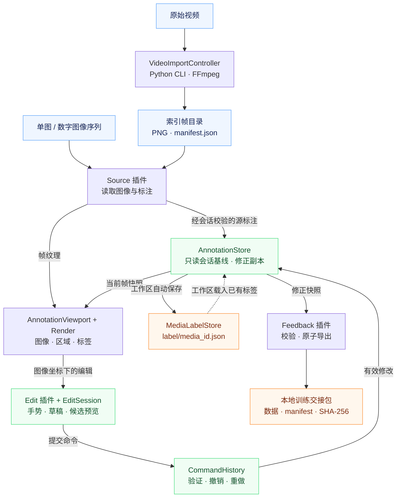

# 自动标注系统

[系统架构](#系统架构) · [环境搭建](#环境搭建) · [快速开始](#快速开始) · [编辑与快捷键](#part-2223-实现状态与验收门禁) · [运行测试](#运行测试) · [仓库布局](#仓库布局与文档)

## 前端 0.0.1


> 当前界面顶部只常驻显示播放速度状态，点击后才展开调节条；下方运行栏同时显示只读帧时间和 actual FPS。

本项目使用 Godot 客户端和 Python 工具链，实现版本化、插件化的图像与视频标注工作流。当前已验证 Assignment Part 1、Part 2.1 Display 和 Part 3.1 Frame-accurate stream。Part 2.2 Editing 的七工具、近闭合填充、撤销/重做和可见编辑性能已通过自动化验证；Part 2.2/2.3 的人工 reviewer 复跑仍待完成。

## 当前交付范围

- 已完成 Part 1.1–1.4、Part 2.1 和 Part 3.1；显式 frame/time、真实视频导入、连续播放、精确 seek 和 10,000 帧有界加载都已验证，Part 3.1 整体为 **PASS**。
- 原始模型输出以 `model_output_vX` 命名并保持只读；编辑结果保存在独立副本中。
- Part 2.2/2.3 整体验收仍为 **待验证**：实现、键盘回归和可见性能已通过，剩余项是人工 reviewer 复跑。
- Part 3.2 batch labelling 仍未完成；现有 range-propagate primitive 不代表已完成该工作流。

详细设计见 [架构说明](docs/architecture.md)，实测证据见 [RESULTS.md](RESULTS.md)，扩展规范见 [Plugin API version 1](docs/plugin-api.md)。

## 系统架构

项目由 **Godot 桌面客户端、Python 数据工具和共享数据契约**组成。[Main](client/app/main.gd) 是应用组装入口，连接工作区、播放控制、界面和四类插件。Python 以本地 CLI 子进程执行视频转帧，通过文件与客户端交换数据。

### 数据如何流动



图中箭头表示数据流。Source 由 `PluginRegistry` 和 `SourceFactory` 发现、选择并打开，`SourceSessionBuilder` 校验后才切换会话；`PlaybackController` 请求明确的帧索引，序列 Source 使用 12 项 LRU 纹理缓存。显示、命中检测和编辑共用 `ViewportTransform`，保存的几何始终使用图像坐标。

### 模块各自负责什么

| 模块 | 代码入口 | 职责与边界 |
|---|---|---|
| 应用与界面 | [app/main.gd](client/app/main.gd) · [ui/](client/ui/) | Main 组装服务、路由事件并切换会话；视口、左右侧栏、工具栏和类别窗口负责展示及输入。 |
| 工作区与保存 | [workspace/](client/workspace/) | 扫描媒体、关联标签文件；`WorkspaceSession` 合并自动保存请求，`MediaLabelStore` 验证并原子写入媒体标签。 |
| 播放与导入 | [services/](client/services/) | 帧索引调度、实际 FPS、12 项纹理缓存、坐标变换和视频导入子进程。 |
| 插件装配 | [pipeline/](client/pipeline/) · [plugins/](client/plugins/) | Registry 校验并创建 Source / Render / Edit / Feedback 插件；Factory 和 SessionBuilder 统一来源打开与会话校验。 |
| 标注与编辑状态 | [domain/](client/domain/) | Store 持有会话基线和修正副本；History 管理已提交命令，EditSession 管理临时草稿；几何与 mask 算法不承担界面或文件保存。 |
| 数据工具与契约 | [python/annotation_data/](python/annotation_data/) · [core/](core/) | Python 提供样本生成、验证和转帧；core 定义 Schema、帧清单、标签文件格式与类别表。 |

原始模型输出保持不可变；工作区优先载入已有 `label/<media_id>.json` 作为本次会话起点，缺失时才尝试导入源标签或初始化空标注。草稿确认后通过命令更新修正副本。工作区自动保存与 Feedback 导出是两个独立出口，后者目前生成本地交接包。完整批量标注工作流和真实模型训练服务尚未接入。

## 开发原则

- 以 MITK 作为 2D 标注交互参考。
- 明确数据和状态所有权，保持模型输出不可变。
- 通过清晰接口连接 Source、Render、Edit 和 Feedback。
- 优先保证可维护、可测试，并遵守 Part 1 边界。

## 开发环境

本项目已经在以下环境中完成验证：

| 组件 | 已验证版本 |
|---|---|
| 操作系统 | Ubuntu 22.04 |
| Godot | Godot 4.7.2-stable |
| Python | Python 3.14.7 |
| FFmpeg | FFmpeg 6.1.2（要求 FFmpeg 6.1+） |
| OpenCV | `opencv-python-headless==4.14.0.94` |

Python 包支持 `>=3.10,<3.15`。所有 Python 依赖的精确版本记录在 `requirements.lock` 中。视频解码要求可执行的 `ffmpeg` 和 `ffprobe`：程序优先使用项目内 `.tools/ffmpeg/bin/`，缺失时才查找系统 `PATH`；正式视频集成测试则强制使用项目内的固定工具，缺失时直接失败而不是 skip。如果使用其他兼容的 Python 小版本或操作系统，需要重新运行本文的完整测试门禁来确认可复现性。

## 环境搭建

以下命令均从仓库根目录运行。

### 1. 创建 Python 环境

```bash
python3.14 -m venv .venv
.venv/bin/python -m pip install --upgrade pip
```

如果系统使用其他受支持的 Python 版本，请将 `python3.14` 替换成相应命令，并确认版本满足 `>=3.10,<3.15`。

### 2. 下载依赖

以下两条命令需要依次执行：

```bash
.venv/bin/python -m pip install -r requirements.lock
.venv/bin/python -m pip install --no-deps -e .
```

第一条安装锁定的第三方依赖；第二条安装当前项目，但不会重新解析依赖版本。

### 3. 配置必要工具

推荐 source 项目环境入口。它不修改 `.bashrc` 或系统目录；只在当前终端设置 `PROJECT6_ROOT`、`PROJECT6_PYTHON`、项目 FFmpeg `PATH` 和 `GODOT_BIN`，并验证版本与可执行性。重复 source 不会重复追加 PATH。

```bash
source scripts/project_env.sh
"$GODOT_BIN" --version
"$PROJECT6_PYTHON" --version
ffmpeg -version
ffprobe -version
```

脚本会依次查找已有 `GODOT_BIN`、系统 `godot4`/`godot`，以及 Linux 常用的 `~/下载`、`~/Downloads` 位置。Godot 输出必须以 `4.7.2.stable` 开头，FFmpeg 和 FFprobe 两条检查命令都必须成功。自定义 Godot 位置可先执行 `export GODOT_BIN=/absolute/path/to/Godot_v4.7.2-stable_linux.x86_64` 再 source。

当前项目已经具备可用的 `.venv` 和 `.tools/ffmpeg`，不需要安装系统 FFmpeg。仅在新 checkout 的脚本提示项目工具缺失时，才需要使用 Conda 在项目目录中部署已验证版本；不要求管理员权限：

```bash
CONDA_PKGS_DIRS="$PWD/.tools/conda-pkgs" conda create --yes \
  --prefix "$PWD/.tools/ffmpeg" --override-channels --channel conda-forge \
  ffmpeg=6.1.2
source scripts/project_env.sh
```

Godot 视频导入器会优先直接使用项目内的 `.tools/ffmpeg/bin/ffmpeg` 和
`.tools/ffmpeg/bin/ffprobe`，因此从桌面或 Godot 编辑器启动客户端时不依赖终端的
`PATH`。项目内和系统工具都不存在时，CLI 会同时报告缺少的工具名、预期项目路径
和 `PATH` 回退条件，不再只显示不明确的 `[Errno 2]`。


## 快速开始

### 1. 生成可复现样本

默认命令使用固定种子 `6006`，将 120 帧合成图像和匹配标注生成到 `sample/assignment_v1`：

```bash
.venv/bin/python python/make_sample_input.py
```

等价的显式命令为：

```bash
.venv/bin/python python/make_sample_input.py --output sample/assignment_v1 --seed 6006
```

输出目录必须不存在。同一 seed 会产生相同文件和 SHA-256。样本每帧约含 20 个 regions，包括一个 12 顶点凹 complex polygon；同时包含 drifted regions、wrong class labels、一个 missed region、一个 hallucinated region、一次 track-id swap，以及第 40–59 帧的 near-identical segment。

### 2. 验证样本

```bash
.venv/bin/python python/validate_model_output.py sample/assignment_v1/model_output_v1.jsonl
```

成功时命令退出状态为 `0`，并输出：

```text
Validation errors: 0
```

权威 Schema 位于 `core/schemas/model_output_v1.schema.json`，Godot 等价验证器位于 `client/domain/model_output_validator.gd`。

### 3. 打开工作区与视频解析

客户端推荐流程：点击 **Open** 选择数据集根目录，再在左侧树中选择图片、视频或数字文件名的图片序列。打开工作区时只扫描元数据；只有选中视频后才使用项目固定的 `.venv/bin/python` 和 FFmpeg 在后台解析，结果固定缓存到工作区的 `.annotool/cache/<media_id>/`。数字图片序列直接按原始帧号排序，不运行 FFmpeg。原有单文件 **Start import** 进度窗口仍保留为兼容入口。

打开外层大目录时，目录扫描会为每个媒体建立标签上下文索引，向上定位最近的数据集根。标注工具只写入该数据集根下的 `label/<media_id>.json`，每个媒体一个 JSON，不生成逐帧 JSON 或额外 manifest。例如 `videos/VID68/000016.png` 的媒体 ID 是 `VID68`，标注键是原始帧号 `16`，训练时才派生样本 ID `VID68_000016`。同一数据集根下的 `labels/VID68.json` 等自带标注只读；首次可导入，之后优先读取 `label/VID68.json`。编辑成功后 300 ms 自动合并保存，切换媒体、工作区或退出前会强制刷新。

也可以直接使用兼容的原有 CLI：

```bash
.venv/bin/python python/frame_source.py input.mp4 --output sample/normalized_video
```

该命令把任意 FFmpeg 可读取的视频转换为带显式索引和时间戳的归一化目录，作为 GUI 按需解析之外的兼容入口。客户端将视频转换结果与原生图像序列统一视为 frames-from-a-source。GUI 不回退到系统 Python；如果 `.venv/bin/python`、`ffmpeg` 或 `ffprobe` 缺失，先按“开发环境”修复，不要绕过已验证工具链。

Part 3.1 已验证的播放控件为 **Previous**、**Play**、**Pause** 和 **Next**。顶部平时只显示当前速度状态，例如 `1 s/frame ▾`；点击后才展开 `Custom`、`3 s/frame`、默认 `1 s/frame` 和 `Max` 四档调节条。Custom 可输入 0.01–60 秒/帧，Max 不增加人工等待但仍逐个连续索引提交。下方运行条以 `Time HH:MM:SS.mmm` 显示当前帧的只读 `time_s`，并显示 actual FPS；时间不是墙钟播放计时。速度选择、时间与 FPS 统计只描述运行时展示，不改写 `frame_id`、`time_s`、Store 或标注 JSON。其真实导入、连续播放与 10,000 帧压力测试证据见 [RESULTS.md](RESULTS.md)，不依赖 Part 2.2/2.3 的待验证重建。

### 4. 启动客户端

首次运行或新增 Godot 资源后，先生成本地导入缓存：

```bash
"$GODOT_BIN" --headless --editor --quit --path .
```

然后启动 Godot 编辑器并点击 **Run Project**：

```bash
"$GODOT_BIN" --editor --path .
```

## Part 2.1 流畅渲染实现

`AnnotationViewport` 只使用一个共享的 image↔viewport `Transform2D`，让等比显示、zoom/pan、overlay 绘制与鼠标 picking 遵守同一套坐标契约。Part 2.1 已验证的 **Overlay opacity** 与 **Fit** 保持在该显示路径中。视口实行 dirty redraw：只在 texture、record、selection、opacity 或变换真正改变后调用 `queue_redraw()`，重复设置同一状态不会再次入队。

Renderer 仅在 annotation record 改变时解析并缓存 image-space primitives，包括 geometry、class color、label 和 bounds。zoom、pan、selection 与 opacity 只重建 screen-space draw commands，不重新解析原始字典；变换后的 AABB 完全离开视口时，该 region 不会生成绘制指令。当前 Select 拖动在独立 EditOverlay 中更新目标几何，正式 Renderer 暂时抑制该目标；预览不写入 Store，释放鼠标后才通过单个 command 提交。

可见 1280×800 基准在 20 个 box/polygon regions 上执行 2 s 预热和 10 s pan、zoom、真实 Selection region drag，记录为平均 `175.27 fps`、p95 帧间隔 `9.572 ms`、拖动坐标误差 `0.0` image px。该次 X11 / Godot 4.7.2 GL Compatibility 会话使用 `llvmpipe`软件适配器；这是当前实测配置的证据，不是对所有笔记本或硬件 GPU 的性能承诺。原始数据见 `tests/benchmarks/results/part2_1_display.json`，完整限制见 [RESULTS.md](RESULTS.md)。当前路径未使用 shader、texture atlas、mesh batching 或 polygon 预三角化；只有后续 profiler 证明高顶点 polygon 成为瓶颈时才应升级该局部路径。

## Part 2.2/2.3 实现状态与验收门禁

截至 2026-09-06，七工具、真实挂载 Main、键盘路径、失败原子性和可见编辑性能已通过自动化验证。Part 2.2/2.3 整体保留 `BLOCKED`，剩余项是正式样本与暂停手术视频帧上的人工 reviewer 复跑。交互参考官方 [MITK Segmentation View](https://docs.mitk.org/latest/org_mitk_views_segmentation.html)，采用、适配和省略的理由见 [RESULTS.md](RESULTS.md)。

工具栏为 **7 个工具**：Add Box、Subtract、Lasso、Fill、Paint、Eraser 和 Select。Select 负责选择、移动、缩放与键盘 nudge；直接删除整个选中对象由空闲 Select 中的 `Delete`/`Backspace` 执行，无选区 Subtract 也可以在几何结果为空时删除被完全覆盖的对象。Close Gaps、Region Growing 和 Live Wire 均已从 descriptor、capability 和快捷键合同中移除，`C` / `E` / `G` / `I` 保持未绑定。

Paint/Eraser 共用 1–40 image-px 的圆形笔刷，默认半径 8 px；空闲时显示空心半径圆，绘制时实时显示操作后的完整 mask。`BrushStrokeBuffer` 只光栅化新增的圆头线段，已有区域只在笔迹接触时按需光栅化。无法安全处理的目标会连同 region ID 报错，保留原标注，不会转成匿名新对象。Paint 重合唯一或选中的对象时做并集，独立单环可新建；Eraser 无需选区，始终擦除笔迹触及的所有对象；完全擦除时删除对象，一笔只生成一个撤销命令。若任一对象产生孔洞或多个连通分量，整笔拒绝并指出对象 ID。

Fill 先寻找包含种子的严格封闭空白连通域；仅在轮廓开放时尝试修补。工具选项 `Gap radius (px)` 为 0/1/2/3 image px，默认 1，0 只允许严格闭合。修补使用方形核闭运算，只保留与本次填充区域相邻的修补连通块；绿色显示填充候选，粉色标出新增修补像素。`Enter` 或 **Apply fill** 接受候选，`Escape` 或 **Cancel** 恢复此前草稿，确认前不改动标注。图像边缘和局部计算范围（ROI）边缘都不能充当缺失的轮廓；超出 1,048,576 像素的局部 mask 会被明确拒绝。

独立 Paint 的空心轮廓保留为橙色 WorkingMask。每次 Fill 把一个封闭空白合并回同一草稿；仍有孔洞时可继续 `F → Arrow → Enter`，全部填完且得到实心单环后才打开类别窗口。草稿 Fill 有独立撤销/重做，最多保留 200 项、32 MiB 像素差异；最终类别确认只产生一条全局命令。全局历史最多 200 条，apply/revert 校验失败时保留 Store 和两侧历史栈。文本框焦点拥有文本撤销，活动草稿拥有局部撤销，其余情况使用全局历史。

Subtract 有选区时修改该对象，无选区时原子处理轨迹覆盖的全部对象；部分覆盖保留剩余几何，完全覆盖删除对象，整批只生成一条命令。Lasso/Subtract 的首尾距离不超过 12 viewport px 时松手自动闭合，`Space` 可强制闭合；“8”形或重复交点轨迹的全部封闭内部共同生成实心候选。最终 holes、多连通分量、自交、退化或越界几何会被拒绝。像素轮廓仅在可安全验证时做最多 0.5 image-px 简化，超过 256 顶点或简化不安全时保留原轮廓。Select 优先选择最上层内部命中；没有内部命中时允许 6 viewport-px 边缘命中，八个缩放柄在 8 viewport px 内取最近者。

可见基准使用 1280×800 窗口、640×360 图像、20 个 regions 和一个 320×150 image-px 编辑目标。Select、Paint、Eraser、zoom/pan 各预热 2 s、测量 10 s，平均 174.49–234.12 fps，p95 帧间隔 6.848–8.775 ms。Paint/Eraser 的提交分别为 82.052/91.566 ms，单独计时，不包含在实时预览帧间隔中。X11 / Godot 4.7.2 GL Compatibility / llvmpipe 的原始结果见 [part2_2_editing.json](tests/benchmarks/results/part2_2_editing.json)；人工 reviewer 状态见 [RESULTS.md](RESULTS.md)。

键盘映射与具体路径：先用 `Tab` / `Shift+Tab` 将焦点移到中央画布。下表 `Arrow` 表示方向键，步长固定为图像坐标：普通 1 px、`Shift+Arrow` 5 px、`Ctrl+Shift+Arrow` 10 px；缩放和平移不改变步长。

| 操作 | 快捷键 |
|---|---|
| 焦点与列表 | `Tab` / `Shift+Tab`；从画布按两次 `Tab` 到 **Current Frame Annotations**，上下键选择行；两次 `Shift+Tab` 返回画布 |
| Select 与前后选择 | 画布按 `V`，再用 `[` / `]` 循环选择对象 |
| 移动 / nudge | `V` 后选中对象，`Arrow` 移动；修饰键使用上述 1/5/10 image-px 步长 |
| box / polygon 缩放 | `V` 后选中对象，`Alt+Arrow` 调整右边和下边；可叠加 `Shift` 或 `Ctrl+Shift` 使用 5/10 px 步长 |
| Add Box | `A` 建立左上角的初始框，`Arrow` 移动、`Alt+Arrow` 调整大小，`Enter` 打开类别窗口并确认 |
| Lasso 新建 polygon | 无选区时 `L` 开始（已有多边形先 `Escape` 清选区），`Arrow` 绘制轮廓，`Backspace` 删除末点，`Space` 闭合；在类别窗口确认 |
| Lasso 绘制中的控制点 | 鼠标逐点点击后，`[` / `]` 选择点击点，`Arrow` 按 1/5/10 px 微调，`Delete` 删除当前点，`Backspace` 删除末点；`Space` 闭合 |
| Lasso 编辑已有顶点 | 先用 Select 或右侧列表选择 polygon，再按 `L`；`[` / `]` 切换顶点，`Arrow` 按 1/5/10 px 移动该点，`Insert` 在下一条边中点加点，`Delete` / `Backspace` 删除该点，`Escape` 取消拖动并退出选区 |
| Subtract 删减 | 选中目标后按 `S`，`Arrow` 绘制删减轮廓，`Backspace` 删除末点，`Space` 提交；批量删减先结束或取消手势，再 `V → Escape → S → Arrow → Space`，无选区时处理全部相交对象 |
| Paint | `P` 开始，`Arrow` 绘制圆头笔迹，`Enter` 完成；新对象进入类别窗口，空心轮廓进入 WorkingMask |
| Eraser | 无需选区，`Shift+P` 开始，`Arrow` 绘制擦除笔迹，`Enter` 提交；笔迹作用于全部触及对象。键盘起点为选中对象中心，无选区时为图像中心；只留下内部孔洞会被 V1 拒绝 |
| Fill 与逐孔继续 | `F` 初始化种子，`Arrow` 移动，`Enter` 填充；WorkingMask 种子从 ROI 中心开始，每填一孔仍可继续移动并按 `Enter`，或再按 `F` 回到 ROI 中心 |
| 接受 / 取消近闭合修补 | 绿色/粉色候选出现后，`Enter` 接受、`Escape` 返回先前草稿；也可 `Tab` 到 **Apply fill** / **Cancel**，用 `Space` 激活 |
| 重标注：类别列表 | 画布选中对象后按 `R`，或在 **Current Frame Annotations** 上下键选行、`Enter`；窗口初始显示全部类别，两次 `Tab` 到建议列表，上下键选类别，`Enter` 确认 |
| 重标注：自由文本 | 同上打开类别窗口，直接输入 **Class label**；`Tab` 到 **Kind (free text)** 可改 kind，保留或输入非空值后按 `Enter` 确认 |
| 新对象类别确认 / 取消 | 窗口自动聚焦并全选 **Class label**；可输入自由文本或按上述建议列表路径选择；`Enter` / **Confirm** 提交，`Escape` / **Cancel** 放弃新对象并返回画布 |
| 删除整个对象 | 画布 `V`、`[` / `]` 选中对象，`Delete` / `Backspace` |
| 取消选区 | 结束或取消当前草稿，`V → Escape` 清除选区，不创建命令 |
| 修改笔刷 / Fill 半径 | 开始草稿前，`Tab` 到相应工具按钮、`Space` 选工具，再 `Tab` 到 **Brush radius** / **Gap radius (px)** 数值框，输入允许值并提交；返回画布后用相应工具快捷键开始 |
| 草稿撤销 / 重做 | WorkingMask 中 `Ctrl+Z` / `Ctrl+Shift+Z` / `Ctrl+Y`；尚未确认的修补候选会先退出候选 |
| 已提交编辑撤销 / 重做 | 无草稿且焦点不在文本框时，`Ctrl+Z` / `Ctrl+Shift+Z` / `Ctrl+Y`；每次新建、移动、缩放、重标注、删减或删除都可逆 |
| 取消未提交草稿 | 画布 `Escape`；修补候选第一次 Escape 仅退回先前草稿，再次 Escape 放弃草稿 |
| 鼠标补充操作 | Select 中拖动对象移动，拖动八个缩放柄调整大小；中键拖动平移；右键清除临时编辑、选区和 hover 并切回 Select；Lasso/Subtract 近距离松手自动闭合 |

Lasso 按实际轮廓顶点绘制和编辑：点击工具后，依次单击 p1、p2、p3……，相邻点按顺序连线；绘制中就能拖动已经点击的点，`Space` 或双击完成闭合，确认类别后这些点继续保持可拖动。逐点轮廓原样保存点击坐标与顺序，包括共线控制点，不做轮廓简化。选中 polygon 后按 `L` 或点击 **Lasso**，圆点位于多边形自身的轮廓上，黄色表示当前顶点；Lasso 隐藏包围框缩放柄，保留对象填色和标签；拖动圆点修改位置，双击边缘插入顶点，选点后按 `Delete` 删除。点击控制点只改变当前顶点；空白处开始新轮廓，重叠位置新建前先按 `Escape` 清选区。已有对象上的每次拖动、插点、删点或键盘微调各产生一条可撤销命令；新建草稿及其点位调整在类别确认时一起提交为一条新建命令，保留对象 ID、类别和其他元数据。鼠标拖动约束在图像内；越界的键盘修改、自交、重复点、退化形状和少于三个顶点均解释拒绝。

双击右侧 **Current Frame Annotations** 中的标签行，即可打开 **Assign annotation class**，从类别列表重新选择或直接填写标签。鼠标停在类别列表上时，滚轮向上/下切换前一个/后一个类别，同步更新 Class、Kind 和颜色；到列表首尾时停止，长列表自动跟随选中项滚动，按 **Confirm** 保存。纯键盘可在右侧标签列表选行后按 `Enter`，或在画布选中对象后按 `R`。对话框焦点顺序为 **Class label → Kind → 建议列表 → Cancel → Confirm**，结束后返回画布。仓库保留的 `InspectorPanel` 有 taxonomy 下拉框和自由文本组件，但当前 Main 不挂载该面板，因此上述路径不依赖旧 Inspector。

人工 reviewer script（仍待复跑；交互取舍报告见 [RESULTS.md Part 2.3](RESULTS.md#part-23-mitk-interaction-fidelity-decision-log)）：

1. 打开正式样本并暂停，再在暂停的手术视频帧上重复以下步骤。先用鼠标检查 Select 高亮、拖动与八柄缩放，再仅用键盘逐行执行上表的新建、移动、缩放、列表和自由文本重标注、Paint/Eraser、Subtract 与整区删除。
2. 每个已提交动作后执行 `Ctrl+Z` 和 `Ctrl+Shift+Z` / `Ctrl+Y`，核对几何、类别和对象数量精确恢复；类别窗口内的 `Ctrl+Z` 只影响文本，未完成的 WorkingMask 不改变全局标注。
3. 用 Paint 画“8”形空心轮廓，按 `F`、方向键、`Enter` 填第一个孔，验证局部撤销/重做，再填第二孔并完成类别确认；最终只出现一个实心对象和一条全局历史记录。
4. 对带小缺口的轮廓分别试 `Gap radius` 0、1、2、3；核对绿色填充和粉色修补位置，先 Escape/Cancel 再重试并 Enter/Apply fill。未闭合到图像外、超大 ROI 和不能表示为 V1 单环的结果应解释拒绝并保留原标注。
5. 用首尾略有偏差和“8”形轨迹检查 Lasso/Subtract 的自动闭合、Space 强制闭合和全部封闭内部；无选区 Subtract 一次撤销应恢复整批。检查 zoom/Fit/中键平移保留预览，以及右键清选区并返回 Select。
6. 双击右侧标签行，先从列表选择，再用自由文本修改 Class/Kind；分别检查 Confirm、Cancel 和重标注后的撤销/重做。鼠标停在建议列表上，用滚轮前后切换并越过一屏，核对选中行、Class、Kind 和颜色同步；滚动本身不保存，移到输入框上滚动不应切换类别。
7. 清除选区后用 Eraser 一笔擦过两个对象，再选中一个不相交的对象重复操作；两次都应只改变笔迹触及的对象，且一次撤销恢复整批。另测完全擦除、空白处擦除及造成内部孔洞/分裂的笔迹，分别核对删除、无新增历史、解释拒绝且全部对象保持原样。

8. 先逐点点击创建一个有凹点的非矩形 polygon，拖动绘制中的 p3，再闭合并确认类别；核对原始点击点的坐标和数量保留、确认后可直接继续拖动 p3、没有包围框控制柄。再选中一个已有 polygon，按 `L` 检查轮廓顶点圆点；单击点不应改变几何，拖动点应只移动该点，双击边插点，Delete 删点。再仅用 `[` / `]`、方向键、Insert、Delete 重复操作，逐次撤销/重做；核对自交及三角形继续删点被解释拒绝、Escape 放弃拖动，并确认清选区后仍可新建 Lasso。完成全部步骤后，将人工结果填写到 `RESULTS.md` 再更新整体验收状态。

## Plugin API 概览

Registry 在启动时扫描 `client/plugins`，验证插件 manifest、API version、Stage 继承关系和方法参数。当前四个扩展点均至少有一个工作插件：

- **Source：**`image_sequence_source` 读取带 manifest 的归一化目录，`numeric_image_sequence_source` 按原始数字帧号读取图像序列，`single_image_source` 将单张图像适配为一个索引帧。
- **Render：**`canvas_region_renderer` 使用共享视口变换绘制图像和 regions。
- **Edit tools：**`basic_edit_tools` 提供上述七工具；自动化实现与可见性能已验证，人工 reviewer 复跑待完成。
- **Export / Feedback：**`file_training_handoff` 验证修正记录并原子生成本地训练交接包。

无论是直接 Open 还是在大工作区中选择媒体，都先通过同一个 `SourceFactory` 探测、路由和创建 Source，再由 `SourceSessionBuilder` 统一验证 manifest、records、frame entries 和首帧纹理。已接受的 frame-entry 映射在会话内固定，Source 后续动态重映射会被拒绝。播放使用连续 `playback_index`，Store、标注和导出使用原始 `frame_id`；数字图像序列的整体源哈希不可用时显式保留为 `source_sha256: null`。

新增插件只需在相应 stage 目录中添加 `plugin.json` 和 Stage 实现，不需要修改 Registry 或 core。完整 manifest 字段、方法签名、生命周期、深拷贝和错误隔离规则见 [docs/plugin-api.md](docs/plugin-api.md)。

## 运行测试

```bash
tests/run_tests.sh
"$GODOT_BIN" --path . --script tests/benchmarks/godot/display_benchmark.gd -- \
  --output /tmp/part2_1_display.json --warmup 2 --duration 10
"$GODOT_BIN" --path . --script tests/benchmarks/godot/editing_benchmark.gd -- \
  --output /tmp/part2_2_editing.json --warmup 2 --duration 10
.venv/bin/python tests/benchmarks/make_part3_sources.py \
  --playback-output /tmp/annotool-part3-playback \
  --stress-output /tmp/annotool-part3-stress
"$GODOT_BIN" --path . --script tests/benchmarks/godot/playback_benchmark.gd -- \
  --source /tmp/annotool-part3-playback --output /tmp/part3_1_playback.json --duration 10
"$GODOT_BIN" --headless --path . --script tests/benchmarks/godot/long_source_benchmark.gd -- \
  --source /tmp/annotool-part3-stress --output /tmp/part3_1_long_source.json
ffmpeg -hide_banner -loglevel error -f lavfi \
  -i testsrc=size=640x360:rate=30 -t 3 -c:v ffv1 /tmp/part3_input.mkv
"$GODOT_BIN" --headless --path . --script tests/benchmarks/godot/video_import_benchmark.gd -- \
  --input /tmp/part3_input.mkv --output /tmp/part3_normalized \
  --result /tmp/part3_1_import.json
```

基准的 `/tmp` 源目录、视频和输出目录都必须预先不存在；如需重跑，请换用新的临时名称。Python 测试必须没有 failure，也不能因为缺少 FFmpeg/FFprobe 而跳过视频集成测试。Godot 测试可能因故意打开损坏图片 fixture 而打印解码警告，但最后必须输出 `PASS: complete Godot test suite`，并以状态 `0` 退出。Part 3.1 可见播放基准要求索引严格连续且零跳帧；性能不足时允许实际播放率低于 nominal FPS，但必须在 `RESULTS.md` 如实记录。

## 仓库布局与文档

<details>
<summary><strong>展开目录与主要入口</strong></summary>

```text
.
├── project.godot                     # Godot 配置；启动 client/app/main.tscn
├── client/
│   ├── app/                          # Main 场景与应用组装
│   ├── ui/                           # 视口、媒体树、标签栏、工具与对话框
│   ├── workspace/                    # 媒体发现、标签适配、会话与自动保存
│   ├── services/                     # 播放、导入、纹理缓存与坐标变换
│   ├── pipeline/                     # 插件注册、Source 工厂、会话校验
│   │   └── stages/                   # Source / Render / Edit / Feedback 接口
│   ├── plugins/
│   │   ├── source/                   # 单图、数字序列、manifest 索引序列
│   │   ├── render/                   # canvas_region_renderer
│   │   ├── edit/                     # basic_edit_tools：七工具与手势状态
│   │   └── feedback/                 # file_training_handoff：本地导出
│   └── domain/
│       ├── annotation_store.gd       # 只读会话基线与修正副本
│       ├── command_history.gd        # 已提交操作的撤销/重做
│       ├── edit_session.gd           # 临时轮廓、mask 与类别待确认状态
│       └── commands/                 # 移动、缩放、重标注、删除等命令
├── python/
│   ├── frame_source.py               # 视频转帧 CLI
│   ├── make_sample_input.py          # 可复现样本 CLI
│   ├── validate_model_output.py      # 模型输出验证 CLI
│   └── annotation_data/              # 可复用的数据处理实现
├── core/
│   ├── schemas/                      # Model Output V1
│   ├── frame_source/                 # 帧源 manifest 契约
│   ├── workspace/                    # 媒体标签文件契约
│   └── taxonomy/                     # 类别与颜色表
├── scripts/                          # 环境配置与运行辅助脚本
├── tests/
│   ├── run_tests.sh                  # Python + Godot 统一测试入口
│   ├── python/                       # 数据、CLI 与文档测试
│   ├── godot/                        # 领域、插件及真实界面事件测试
│   ├── fixtures/                     # 跨语言有效/无效测试数据
│   └── benchmarks/                   # 性能脚本与原始测量结果
└── docs/                             # Assignment、架构、接口与需求追踪
```

上表列出维护入口；运行时生成的样本、媒体标签和导出包不属于源代码模块。

</details>

| 文档 | 内容 |
|---|---|
| [Architecture](docs/architecture.md) | 所有权、调用边界、会话切换和持久化细节 |
| [Plugin API version 1](docs/plugin-api.md) | 插件 manifest、接口与扩展约定 |
| [Assignment results](RESULTS.md) | 功能证据、性能数据及 MITK 交互取舍 |
| [Requirements traceability](docs/requirements-traceability.md) | 作业条目到实现和验证的映射 |
| [Editing review](output/pdf/Editing_Review.pdf) | 编辑功能检查报告；验收状态以 RESULTS.md 为准 |
| [Part 3.2 design](output/pdf/Part3_Batch_Design.pdf) | 批量标注要求、算法边界与交互设计研究；尚未实施 |

生成样本、本地数据集、测试输出、Godot import cache、虚拟环境、本地工具和大型二进制资产均不得提交。仓库也不得包含 API key、凭据或私有配置；这些本地内容通过 `.gitignore` 隔离，不要求删除。
