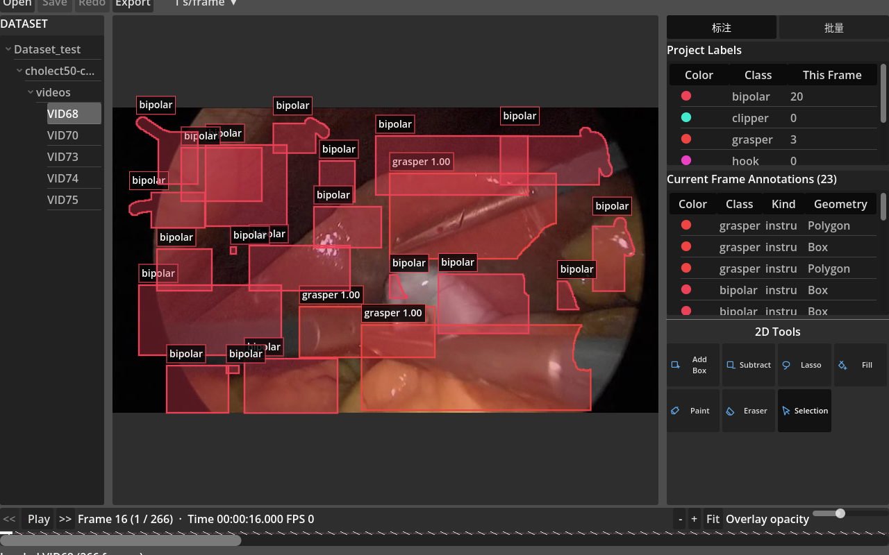
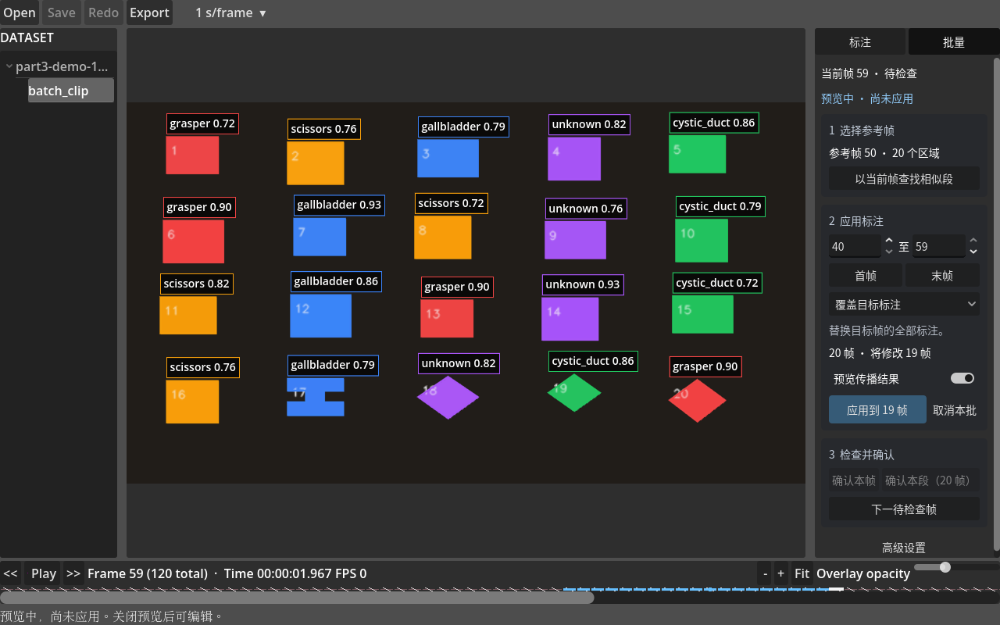
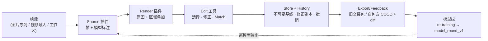

# Project 6 自动标注系统

以 Godot 4 为客户端的人机协作标注工具:读取图片序列或视频帧,在原图上叠加模型识别区域,支持可撤销的 2D 修正、相似连续帧批量传播、审核状态管理与版本化训练交接。本仓库交付工具与数据合同,不交付训练好的模型。




## 交付概览

| Assignment | 交付内容 | 状态 |
|---|---|---|
| Part 1 数据契约 · 样本 · 插件 | `model_output_v1` JSON Schema + Python/Godot 双端验证器;固定种子样本生成器(含 6 类植入缺陷);视频帧源;Source / Render / Edit / Export 四类插件与启动时注册表 | 完成 |
| Part 2 显示与编辑 | 统一 image↔viewport 变换;8 个编辑工具(7 个 Assignment 工具 + Match，含顶点编辑、近似闭合 Fill);MITK 编辑范式对照;20 regions 实测 175 fps | 完成(人工 reviewer 复跑待记录) |
| Part 3 视频流与批量标注 | 后台 FFmpeg 无丢帧导入;帧精确播放;**SAM 2 Video** 批量传播(默认)+ Poly 光流(显式备选) | 自动协议/安全 PASS;真实视频精度/效率未测 |
| Part 4 交接与协作 | V3 会话、原子保存、diff、旧六文件包、自包含 `training_coco_v1`、`model_round_v1` | 新 COCO E01–E48 自动验收 PASS;真实训练未运行 |
| Part 5 质量与测试 | 当前 889 项 Python 通过；聚合脚本 28 次 Godot 调用全部通过严格日志审计 | 全帧 COCO 导出、旧包和编辑流程共同回归 |

## 开发原则

- 以 Assignment 和 MITK 的手动编辑范式为交互参考,只适配到 2D 视频 region,不声称与 MITK 等价。
- 每一类状态只有一个明确所有权边界:Source 提供帧,Store 保管不可变基线与修正副本,History 只接受已验证命令。
- Source、Render、Edit、Export 通过清晰接口解耦,插件故障被隔离为可读错误,不让 UI 崩溃。
- 可维护和可复现优先于功能数量;生成样本、测试、基准和导出都必须可追溯。
- Part 1 边界是版本化数据合同、可复现样本、帧源和四类插件;不把批量元数据塞进严格的 Model Output V1。

## 快速开始

已验证环境:Ubuntu 22.04 · Godot 4.7.2-stable · Python 3.14.7(支持 `>=3.12,<3.15`)· FFmpeg 6.1+。依赖以 [pyproject.toml](pyproject.toml) 为唯一来源,固定版本。

```bash
python3.14 -m venv .venv
.venv/bin/python -m pip install -e ".[dev]"
source project_env.sh          # 校验 Python/FFmpeg/Godot 并导出 PROJECT6_PYTHON 等变量
ffmpeg -version
```

生成确定性样本并通过独立验证器:

```bash
.venv/bin/python python/make_sample_input.py --output sample/assignment_v1 --seed 6006
.venv/bin/python python/validate_model_output.py sample/assignment_v1/model_output_v1.jsonl
# 预期最后一行:Validation errors: 0
```

样本为 120 帧,含全部植入缺陷:漂移(帧 12–13)、错误类别(帧 24)、漏检、幻觉、track-id 交换,以及连续近似帧段(帧 40–59,供 Part 3 批量演示);每帧含一个 12 顶点凹 complex polygon。同一种子的核心文件 SHA-256 一致。

启动客户端:

```bash
"$GODOT_BIN" --editor --path .
# 在编辑器中运行 client/app/main.tscn
```

打开数据源三种方式:**Open Source**(单张图像 / 归一化目录 / `training_coco_v1` 包)、**Open Video**(选择视频后 `Start import`,FFmpeg 后台原子导入为帧目录)、**Open Workspace**(工作区文件夹或 Endoscapes2023 根目录)。也可 Open 包含多个 `training_coco_v1_*` 的上级目录，再选择其中一包。包内 COCO 标注作为可编辑导入基线，新会话的审核状态全部重置为未验证；修改只保存到包外的 Project6 会话文件，不改写训练包。

## Reviewer 验收脚本

按顺序执行,每步都应得到预期结果;任何一步失败请记录操作与现象。

| # | 验证点 | 操作 | 预期 |
|---|---|---|---|
| 1 | 显示 | 打开 `sample/assignment_v1`;滚轮缩放、中键平移、`Fit`;调 `Overlay opacity` | 宽高比保持;box/polygon/类别/置信度可见;半透明只影响填充 |
| 2 | 选择与变换 | Select 点击、拖动、八柄缩放;`Arrow`/`Shift+Arrow`/`Ctrl+Shift+Arrow` 微移 | 命中最上层区域;1/5/10 px 步进准确 |
| 3 | 八个工具 | 依次使用 Add Box、Subtract、Lasso、Fill、Paint、Eraser、Select、Match | 各工具生效;Lasso 中可拖动已存 polygon 顶点;Match 先点 A 再点 B 完成合并 |
| 4 | 撤销与拒绝 | 对每种编辑 `Ctrl+Z`/`Ctrl+Shift+Z`;构造自交 polygon | 撤销/重做完整;非法几何被原子拒绝并给出原因 |
| 5 | 播放 | `Previous`/`Play`/`Pause`/`Next`;切换 `Custom`/`3s`/`1s`/`Max` | 帧号与 `HH:MM:SS.mmm` 同步显示;actual FPS 只读;不跳帧 |
| 6 | SAM 批量传播 | Batch 选中已提交 region，设置 1–30 个目标，点击“生成并保存标注” | 一次点击即写入、保存并标为已确认；拓扑停止只保存合法前缀并跳到异常帧；一次 undo/redo 完整恢复 |
| 7 | 保存与导出 | `Ctrl+S`；Endoscapes 在 Export 中选任务，帧范围留空=全部 Source 帧，也可显式选子集 | 原子保存；自包含原图 + COCO + diff + manifest；无标注帧是零目标图像，导出不会改审核状态 |
| 8 | 模型轮次 | Model Round 预览并提交模型返回 | 旧轮次字节归档;新轮次 verification/batch 为空 |

## 快捷键

| 操作 | 快捷键 |
|---|---|
| Select / Add Box / Subtract / Lasso / Fill / Paint / Eraser | `V` / `A` / `S` / `L` / `F` / `P` / `Shift+P` |
| Match | 工具栏按钮 |
| 上一个 / 下一个区域 | `[` / `]` |
| 重标签 / 删除 | `R` / `Delete` |
| 撤销 / 重做 | `Ctrl+Z` / `Ctrl+Shift+Z` |
| 移动 1/5/10 px | `Arrow` / `Shift+Arrow` / `Ctrl+Shift+Arrow` |
| 缩放选中区域 1/5/10 px | `Alt+Arrow` / `Alt+Shift+Arrow` / `Ctrl+Alt+Shift+Arrow` |
| 闭合 Lasso/Subtract | `Space` |
| 确认 / 删除最后顶点 / 取消 | `Enter` / `Backspace` / `Escape` |
| 缩放 / 平移 / 适配 | 滚轮 / 中键拖动 / `Fit` |

`Tab`/`Shift+Tab` 遍历工具、列表与对话框;文本框内快捷键让位给文本编辑。

## 架构



Source、Render、Edit、Feedback 均为可替换插件,Registry 启动时扫描 `client/plugins` 加载。当前插件:Source `image_sequence_source` / `numeric_image_sequence_source` / `single_image_source` / `endoscapes_video_source` / `training_coco_package_source`,Render `canvas_region_renderer`,Edit `basic_edit_tools`,Export/Feedback `file_training_handoff`。模块所有权与数据流详见 [docs/architecture.md](docs/architecture.md),插件扩展规范见 [docs/plugin-api.md](docs/plugin-api.md)。

## 视图与播放

`ViewportTransform` 向绘制与命中测试提供同一个 `Transform2D`,dirty redraw 只在图像、record、selection、opacity 或 transform 变化时触发,Renderer 缓存 image-space primitives 并用 AABB 裁剪视口外区域。可复现基准(1280×800、20 regions、llvmpipe)实测 **175.27 fps** 平均、p95 **9.572 ms**,复现命令见 [RESULTS.md](RESULTS.md)。

Part 3.1 整体为 **PASS**。视频由 `VideoImportController` 通过 `Start import` 无丢帧后台解码;播放提供 `Previous`/`Play`/`Pause`/`Next` 与 `Custom`/`3 s/frame`/`1 s/frame`/`Max` 节奏,显式帧号 + `Time HH:MM:SS.mmm` 与 actual FPS 只读显示;对 10,000 帧源纹理缓存仍不超过 12 张。

Endoscapes 工作区经 "Open Workspace" 直接打开;真实数据集只读验收复跑(输出目录必须事先不存在,边界见 `docs/endoscapes-poly-acceptance.md`):

```bash
"$PROJECT6_PYTHON" python/run_endoscapes_lazy_source_acceptance.py \
  --dataset-root Dataset_test/endoscapes \
  --output .local-acceptance/endoscapes-lazy-source-new
```

## SAM 2 Video 运行时（可选，Batch 唯一入口）

SAM 只从 Batch 启动，并只读取下面四个环境变量；项目不自动安装 `sam2`、不下载权重，未配置时普通编辑、Poly 与 copy 不受影响。选中已提交的单个 Box/Poly，在主设置中选择 1–30 个目标帧，点击“生成并保存标注”：合法结果在一次原子命令中写入正式标注、审核摘要和 v3 audit，随后保存到磁盘并立即标为已确认，不显示候选预览或二次 Apply。“高级设置”可提高最低模型确定度，或启用相邻轮廓面积变化门禁；默认值保持原有接受范围，且不可放宽 V1 拓扑、边界、文件完整性和 0.99 栅格回环 IoU 底线。完成后 Batch 保持打开；默认折叠且与其他段落同样式的“2 日志”保留分析、校验、写入、保存和导航记录；没有结果时不显示空的生成状态卡。遇到 V1 不可表示拓扑时只保存合法前缀并停在精确异常帧，用户确认日志后可显式进入普通编辑工具修正，再返回 Batch 重新生成。单帧 Model Assist 前端、`M` 快捷键及其 action row 已退役，Edit 插件激活不会启动其 Python 预检。`poly-sim-flow-edge-v1` 仅为显式备选；SAM 失败不静默回退。

```bash
export PROJECT6_MODEL_PYTHON=/path/to/conda/env/bin/python   # 需已安装官方 sam2 + torch
export PROJECT6_SAM2_CONFIG=/path/to/sam2.1/configs/sam2.1/sam2.1_hiera_t.yaml
export PROJECT6_SAM2_CHECKPOINT=/path/to/sam2.1_hiera_tiny.pt
export PROJECT6_SAM2_DEVICE=auto   # auto | cpu | cuda
```

## 本地验证记录

按发布边界，GitHub 仓库不包含 `tests/`、测试输出和两个真实模型 smoke 驱动；它们只保留在完整的本地开发工作区。下面的命令用于维护者在该完整工作区复核，不是公开仓库附带的运行入口。

```bash
source project_env.sh
bash tests/run_tests.sh    # Python + Godot 全量门禁
```

可复现基准单独运行(临时输出目录必须事先不存在):

```bash
"$GODOT_BIN" --path . --script tests/benchmarks/godot/display_benchmark.gd -- --output /tmp/part2_display.json --warmup 2 --duration 10
"$PROJECT6_PYTHON" tests/benchmarks/make_part3_sources.py --playback-output /tmp/part3-playback --stress-output /tmp/part3-stress
"$GODOT_BIN" --path . --script tests/benchmarks/godot/playback_benchmark.gd -- --source /tmp/part3-playback --output /tmp/part3_playback.json --duration 10
"$GODOT_BIN" --headless --path . --script tests/benchmarks/godot/long_source_benchmark.gd -- --source /tmp/part3-stress --output /tmp/part3_long.json
"$GODOT_BIN" --headless --path . --script tests/benchmarks/godot/video_import_benchmark.gd -- --input /tmp/input.mkv --output /tmp/part3-import --result /tmp/part3_import.json
```

本轮新鲜结果：**889 Python tests passed (56.60 s)**；权威 `tests/run_tests.sh` 中 **28 次 Godot 调用全部退出 0 并通过严格日志审计**。默认全 Source 帧、上版基线、无标注零目标帧、未审核来源状态、训练包可编辑导入与篡改拒绝，以及 SAM 质量门槛审计均有回归。COCO 逐项证据见 [training-coco-v1-acceptance.md](docs/Part%204%20设计与复现/training-coco-v1-acceptance.md)。

## 演示视频

[docs/Project6_Demo.mp4](docs/Project6_Demo.mp4)(≤3 分钟,配套字幕 [Project6_Demo.srt](docs/Project6_Demo.srt))。演示流程:打开样本 → 逐类修正植入缺陷 → 批量标注近似帧段 → 导出与 diff → 提交训练包。

## 文档索引

| 文档 | 内容 |
|---|---|
| [RESULTS.md](RESULTS.md) | 设计决策、测量数据、失败分析 |
| [docs/architecture.md](docs/architecture.md) | 架构图、模块所有权、数据流 |
| [docs/plugin-api.md](docs/plugin-api.md) | 插件 API v1 合同 |
| [docs/requirements-traceability.md](docs/requirements-traceability.md) | Assignment 逐条追踪与状态 |
| [docs/Part 4 模型组接口协议/part4-protocol.md](docs/Part%204%20模型组接口协议/part4-protocol.md) | 模型组交接协议(附一页 PDF) |
| [docs/Part 4 设计与复现/part4-review.md](docs/Part%204%20设计与复现/part4-review.md) | Part 4 CLI/UI 复现流程 |
| [docs/Part 4 设计与复现/training-coco-v1-acceptance.md](docs/Part%204%20设计与复现/training-coco-v1-acceptance.md) | 自包含 COCO 合同、E01–E48、真实/合成包与回退边界 |
| [docs/sam-video-batch-acceptance.md](docs/sam-video-batch-acceptance.md) | SAM 2 Video 验收合同 |
| [docs/model-assist-acceptance.md](docs/model-assist-acceptance.md) | 已退役单帧 Model Assist 的历史验收记录（非当前 UI） |
| [docs/poly-propagation.md](docs/poly-propagation.md) | Poly 备选算法与门禁 |
| [docs/endoscapes-lazy-source-design.md](docs/endoscapes-lazy-source-design.md) | Endoscapes 懒加载源设计 |
| [docs/Endoscapes 真实数据源/endoscapes-poly-acceptance.md](docs/Endoscapes%20真实数据源/endoscapes-poly-acceptance.md) | 真实数据验收边界 |

## 完成度边界

诚实汇报,不做超出证据的声明:

- 真实 SAM Video 的功能、可见 UI、独立真值精度、人工效率与 CUDA 性能均 **未测量**(NOT RUN)；已通过的是自动协议/安全门禁。既有单帧真实 SAM smoke（CPU 与 CUDA）仅为历史后端证据，不能替代 Batch 验收。
- Part 2 的人工 reviewer 复跑尚未正式记录；单帧 Model Assist UI 已退役，不再列为待验收功能。
- Endoscapes 已实际生成并视觉抽查检测 COCO 包；真实会话只有 box，实例分割正确返回 `SEGMENTATION_REQUIRED`，不声称真实分割交付。
- Part 4 模型返回仍是模拟数据，不代表实际重训。不在范围：3D 体数据、通用真实训练服务。
