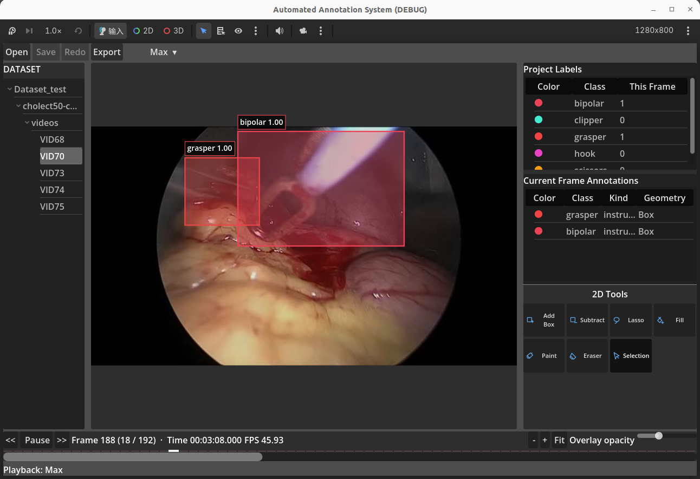

# 自动标注系统

## 前端 0.0.1



> 当前界面顶部只常驻显示播放速度状态，点击后才展开调节条；下方运行栏同时显示只读帧时间和 actual FPS。

本项目使用 Godot 客户端和 Python 工具链，实现版本化、插件化的图像与视频标注工作流。当前已验证 Assignment Part 1、Part 2.1 Display 和 Part 3.1 Frame-accurate stream。Part 2.2 Editing 的七工具实现已通过自动化回归，仍需完成可见性能与人工 reviewer 门禁后才能标记 PASS。

## 当前交付范围

- 已完成 Part 1.1–1.4、Part 2.1 和 Part 3.1；显式 frame/time、真实视频导入、连续播放、精确 seek 和 10,000 帧有界加载都已验证，Part 3.1 整体为 **PASS**。
- 原始模型输出以 `model_output_vX` 命名并保持只读；编辑结果保存在独立副本中。
- Part 2.2/2.3 仍为 **待验证**：七工具运行时和自动化门禁已经实现；可见性能与人工 reviewer 复跑尚未完成。
- Part 3.2 batch labelling 仍未完成；现有 range-propagate primitive 不代表已完成该工作流。

详细设计见 [架构说明](docs/architecture.md)，实测证据见 [RESULTS.md](RESULTS.md)，扩展规范见 [Plugin API version 1](docs/plugin-api.md)。

## 开发原则

- 以 MITK 作为 2D 标注交互参考。
- 明确数据和状态所有权，保持模型输出不可变。
- 通过清晰接口连接 Source、Render、Edit 和 Feedback。
- 优先保证可维护、可测试，并遵守 Part 1 边界。

## 开发环境

本项目已经在以下环境中完成验证：

| 组件 | 已验证版本 |
|---|---|
| 操作系统 | Ubuntu 22.04 |
| Godot | Godot 4.7.2-stable |
| Python | Python 3.14.7 |
| FFmpeg | FFmpeg 6.1.2（要求 FFmpeg 6.1+） |
| OpenCV | `opencv-python-headless==4.14.0.94` |

Python 包支持 `>=3.10,<3.15`。所有 Python 依赖的精确版本记录在 `requirements.lock` 中。视频解码要求可执行的 `ffmpeg` 和 `ffprobe`：程序优先使用项目内 `.tools/ffmpeg/bin/`，缺失时才查找系统 `PATH`；正式视频集成测试则强制使用项目内的固定工具，缺失时直接失败而不是 skip。如果使用其他兼容的 Python 小版本或操作系统，需要重新运行本文的完整测试门禁来确认可复现性。

## 环境搭建

以下命令均从仓库根目录运行。

### 1. 创建 Python 环境

```bash
python3.14 -m venv .venv
.venv/bin/python -m pip install --upgrade pip
```

如果系统使用其他受支持的 Python 版本，请将 `python3.14` 替换成相应命令，并确认版本满足 `>=3.10,<3.15`。

### 2. 下载依赖

以下两条命令需要依次执行：

```bash
.venv/bin/python -m pip install -r requirements.lock
.venv/bin/python -m pip install --no-deps -e .
```

第一条安装锁定的第三方依赖；第二条安装当前项目，但不会重新解析依赖版本。

### 3. 配置必要工具

推荐 source 项目环境入口。它不修改 `.bashrc` 或系统目录；只在当前终端设置 `PROJECT6_ROOT`、`PROJECT6_PYTHON`、项目 FFmpeg `PATH` 和 `GODOT_BIN`，并验证版本与可执行性。重复 source 不会重复追加 PATH。

```bash
source scripts/project_env.sh
"$GODOT_BIN" --version
"$PROJECT6_PYTHON" --version
ffmpeg -version
ffprobe -version
```

脚本会依次查找已有 `GODOT_BIN`、系统 `godot4`/`godot`，以及 Linux 常用的 `~/下载`、`~/Downloads` 位置。Godot 输出必须以 `4.7.2.stable` 开头，FFmpeg 和 FFprobe 两条检查命令都必须成功。自定义 Godot 位置可先执行 `export GODOT_BIN=/absolute/path/to/Godot_v4.7.2-stable_linux.x86_64` 再 source。

当前项目已经具备可用的 `.venv` 和 `.tools/ffmpeg`，不需要安装系统 FFmpeg。仅在新 checkout 的脚本提示项目工具缺失时，才需要使用 Conda 在项目目录中部署已验证版本；不要求管理员权限：

```bash
CONDA_PKGS_DIRS="$PWD/.tools/conda-pkgs" conda create --yes \
  --prefix "$PWD/.tools/ffmpeg" --override-channels --channel conda-forge \
  ffmpeg=6.1.2
source scripts/project_env.sh
```

Godot 视频导入器会优先直接使用项目内的 `.tools/ffmpeg/bin/ffmpeg` 和
`.tools/ffmpeg/bin/ffprobe`，因此从桌面或 Godot 编辑器启动客户端时不依赖终端的
`PATH`。项目内和系统工具都不存在时，CLI 会同时报告缺少的工具名、预期项目路径
和 `PATH` 回退条件，不再只显示不明确的 `[Errno 2]`。


## 快速开始

### 1. 生成可复现样本

默认命令使用固定种子 `6006`，将 120 帧合成图像和匹配标注生成到 `sample/assignment_v1`：

```bash
.venv/bin/python python/make_sample_input.py
```

等价的显式命令为：

```bash
.venv/bin/python python/make_sample_input.py --output sample/assignment_v1 --seed 6006
```

输出目录必须不存在。同一 seed 会产生相同文件和 SHA-256。样本每帧约含 20 个 regions，包括一个 12 顶点凹 complex polygon；同时包含 drifted regions、wrong class labels、一个 missed region、一个 hallucinated region、一次 track-id swap，以及第 40–59 帧的 near-identical segment。

### 2. 验证样本

```bash
.venv/bin/python python/validate_model_output.py sample/assignment_v1/model_output_v1.jsonl
```

成功时命令退出状态为 `0`，并输出：

```text
Validation errors: 0
```

权威 Schema 位于 `core/schemas/model_output_v1.schema.json`，Godot 等价验证器位于 `client/domain/model_output_validator.gd`。

### 3. 打开工作区与视频解析

客户端推荐流程：点击 **Open** 选择数据集根目录，再在左侧树中选择图片、视频或数字文件名的图片序列。打开工作区时只扫描元数据；只有选中视频后才使用项目固定的 `.venv/bin/python` 和 FFmpeg 在后台解析，结果固定缓存到工作区的 `.annotool/cache/<media_id>/`。数字图片序列直接按原始帧号排序，不运行 FFmpeg。原有单文件 **Start import** 进度窗口仍保留为兼容入口。

打开外层大目录时，目录扫描会为每个媒体建立标签上下文索引，向上定位最近的数据集根。标注工具只写入该数据集根下的 `label/<media_id>.json`，每个媒体一个 JSON，不生成逐帧 JSON 或额外 manifest。例如 `videos/VID68/000016.png` 的媒体 ID 是 `VID68`，标注键是原始帧号 `16`，训练时才派生样本 ID `VID68_000016`。同一数据集根下的 `labels/VID68.json` 等自带标注只读；首次可导入，之后优先读取 `label/VID68.json`。编辑成功后 300 ms 自动合并保存，切换媒体、工作区或退出前会强制刷新。

也可以直接使用兼容的原有 CLI：

```bash
.venv/bin/python python/frame_source.py input.mp4 --output sample/normalized_video
```

该命令把任意 FFmpeg 可读取的视频转换为带显式索引和时间戳的归一化目录，作为 GUI 按需解析之外的兼容入口。客户端将视频转换结果与原生图像序列统一视为 frames-from-a-source。GUI 不回退到系统 Python；如果 `.venv/bin/python`、`ffmpeg` 或 `ffprobe` 缺失，先按“开发环境”修复，不要绕过已验证工具链。

Part 3.1 已验证的播放控件为 **Previous**、**Play**、**Pause** 和 **Next**。顶部平时只显示当前速度状态，例如 `1 s/frame ▾`；点击后才展开 `Custom`、`3 s/frame`、默认 `1 s/frame` 和 `Max` 四档调节条。Custom 可输入 0.01–60 秒/帧，Max 不增加人工等待但仍逐个连续索引提交。下方运行条以 `Time HH:MM:SS.mmm` 显示当前帧的只读 `time_s`，并显示 actual FPS；时间不是墙钟播放计时。速度选择、时间与 FPS 统计只描述运行时展示，不改写 `frame_id`、`time_s`、Store 或标注 JSON。其真实导入、连续播放与 10,000 帧压力测试证据见 [RESULTS.md](RESULTS.md)，不依赖 Part 2.2/2.3 的待验证重建。

### 4. 启动客户端

首次运行或新增 Godot 资源后，先生成本地导入缓存：

```bash
"$GODOT_BIN" --headless --editor --quit --path .
```

然后启动 Godot 编辑器并点击 **Run Project**：

```bash
"$GODOT_BIN" --editor --path .
```

## Part 2.1 流畅渲染实现

`AnnotationViewport` 只使用一个共享的 image↔viewport `Transform2D`，让等比显示、zoom/pan、overlay 绘制与鼠标 picking 遵守同一套坐标契约。Part 2.1 已验证的 **Overlay opacity** 与 **Fit** 保持在该显示路径中。视口实行 dirty redraw：只在 texture、record、selection、opacity 或变换真正改变后调用 `queue_redraw()`，重复设置同一状态不会再次入队。

Renderer 仅在 annotation record 改变时解析并缓存 image-space primitives，包括 geometry、class color、label 和 bounds。zoom、pan、selection 与 opacity 只重建 screen-space draw commands，不重新解析原始字典；变换后的 AABB 完全离开视口时，该 region 不会生成绘制指令。拖动预览会修改当前 record snapshot，因此需要重建 geometry，但预览不写入 Store，释放鼠标后才通过单个 command 提交。

可见 1280×800 基准在 20 个 box/polygon regions 上执行 2 s 预热和 10 s pan、zoom、真实 Selection region drag，记录为平均 `175.27 fps`、p95 帧间隔 `9.572 ms`、拖动坐标误差 `0.0` image px。该次 X11 / Godot 4.7.2 GL Compatibility 会话使用 `llvmpipe`软件适配器；这是当前实测配置的证据，不是对所有笔记本或硬件 GPU 的性能承诺。原始数据见 `tests/benchmarks/results/part2_1_display.json`，完整限制见 [RESULTS.md](RESULTS.md)。当前路径未使用 shader、texture atlas、mesh batching 或 polygon 预三角化；只有后续 profiler 证明高顶点 polygon 成为瓶颈时才应升级该局部路径。

## Part 2.2/2.3 实现状态与验收门禁

Part 2.2 Editing 已进入可运行的七工具版本，Part 2.3 记录其与 MITK 类工具的适配边界。当前仍不能标记 PASS，原因是可见编辑性能和人工 reviewer 门禁尚未完成。

工具栏为 **7 个工具**：Add Box、Subtract、Lasso、Fill、Paint、Eraser 和 Select。Select 负责选择、移动、缩放与键盘 nudge；直接删除整个选中对象由空闲 Select 中的 `Delete`/`Backspace` 执行，无选区 Subtract 也可以在几何结果为空时删除被完全覆盖的对象。Close Gaps、Region Growing 和 Live Wire 均已从 descriptor、capability 和快捷键合同中移除，`C` / `E` / `G` / `I` 保持未绑定。

选中 Paint 或 Eraser 后，鼠标未按下时也会显示当前半径的空心笔刷圆，并跟随图像内鼠标；提交成功后笔刷圆会立即恢复。按下和移动时直接生成“本次操作后的完整 mask”预览，不绘制输入轨迹或中心点。Paint 与一个已有对象重合时对它做并集修补；无重合且结果是单环时直接创建新对象。如果无重合 Paint 形成闭合空心轮廓，它会保留为橙色临时 Working Mask；每次 Fill 只把点击到的封闭空白合并回同一 mask，其他孔洞仍可继续 Fill。只有所有孔洞填完并得到单个实心 V1 polygon 时才打开类别窗口；失败点击不会清空轮廓。Eraser 仅对当前选中对象做差集。

Fill 是标注层的连通域填充：单击已有标注边界包围的空白处时，系统提取包含该点的最小封闭空白连通分量；对 Paint Working Mask 则累积填入被点击的每个孔洞，例如两次点击可将“8”形轮廓转为一个实心葫芦形对象。Subtract 有选区时只修改该对象；无选区时一次处理轨迹覆盖的所有对象，部分覆盖保留剩余几何，完全覆盖删除整个对象，整批只生成一条撤销记录。Lasso/Subtract 松手时会对屏幕距离不超过 12 px 的首尾点自动吸附闭合，`Space` 仍可强制闭合；对“8”形或重复交点轨迹，系统会提取所有封闭内部作为一个实心复杂 polygon/删减 mask。最终剩余几何无法表达为 V1 单环时仍会整批拒绝。画布平移只使用鼠标中键拖动。

真实 `ToolPanel → AnnotationViewport → Edit plugin → CommandHistory → Store`、七工具、键盘、undo/redo 和 V1 原子拒绝路径已经通过 Godot 自动化回归。剩余 **待验证** 门禁为 1280×800 可见编辑性能，以及正式样本和暂停手术视频帧上的人工 reviewer 复跑；完成前 Part 2.2/2.3 继续保持 BLOCKED。

键盘映射（自动化已验证，仍需人工复跑）：

| 操作 | 快捷键 |
|---|---|
| 标准焦点遍历 | `Tab` / `Shift+Tab` |
| Select / Add Box / Subtract / Lasso / Fill | `V` / `A` / `S` / `L` / `F` |
| Paint / Eraser | `P` / `Shift+P` |
| Select 中删除选区 | `Delete` / `Backspace` |
| 取消选区并切回 Select | 鼠标右键 |
| Lasso / Subtract 闭合 | 近距离松手自动吸附；`Space` 强制闭合 |
| 其他空间工具输入与取消 | `Arrow` / `Alt+Arrow` / `Enter` / `Escape` |
| 撤销/重做 | `Ctrl+Z` / `Ctrl+Shift+Z` |
| 向后/向前选择 | `[` / `]` |

人工 reviewer 顺序：暂停在一张含标注的图像或视频帧；依次验证 Select 移动/缩放、Add Box、Subtract、Lasso、Fill、Paint 和 Eraser；选中对象后右键，确认选区清除并切回 Select；用 Paint 画一个“8”，确认第一次 Fill 后另一个孔仍可继续填充，第二次 Fill 后才弹出类别窗口并生成一个实心对象；分别用首尾略有偏差和“8”形轨迹测试 Lasso/Subtract，确认近距离松手自动闭合、多个封闭内部全部生效，一次 `Ctrl+Z` 恢复整批；再验证中键平移、`Space` 强制闭合、其他快捷键和类别窗口。

## Plugin API 概览

Registry 在启动时扫描 `client/plugins`，验证插件 manifest、API version、Stage 继承关系和方法参数。当前四个扩展点均至少有一个工作插件：

- **Source：**`image_sequence_source` 读取归一化目录，`single_image_source` 将单张图像适配为一个索引帧。
- **Render：**`canvas_region_renderer` 使用共享视口变换绘制图像和 regions。
- **Edit tools：**`basic_edit_tools` 提供上述七工具；自动化实现已验证，可见性能与人工 reviewer 门禁仍待完成。
- **Export / Feedback：**`file_training_handoff` 验证修正记录并原子生成本地训练交接包。

新增插件只需在相应 stage 目录中添加 `plugin.json` 和 Stage 实现，不需要修改 Registry 或 core。完整 manifest 字段、方法签名、生命周期、深拷贝和错误隔离规则见 [docs/plugin-api.md](docs/plugin-api.md)。

## 运行测试

```bash
tests/run_tests.sh
"$GODOT_BIN" --path . --script tests/benchmarks/godot/display_benchmark.gd -- \
  --output /tmp/part2_1_display.json --warmup 2 --duration 10
.venv/bin/python tests/benchmarks/make_part3_sources.py \
  --playback-output /tmp/annotool-part3-playback \
  --stress-output /tmp/annotool-part3-stress
"$GODOT_BIN" --path . --script tests/benchmarks/godot/playback_benchmark.gd -- \
  --source /tmp/annotool-part3-playback --output /tmp/part3_1_playback.json --duration 10
"$GODOT_BIN" --headless --path . --script tests/benchmarks/godot/long_source_benchmark.gd -- \
  --source /tmp/annotool-part3-stress --output /tmp/part3_1_long_source.json
ffmpeg -hide_banner -loglevel error -f lavfi \
  -i testsrc=size=640x360:rate=30 -t 3 -c:v ffv1 /tmp/part3_input.mkv
"$GODOT_BIN" --headless --path . --script tests/benchmarks/godot/video_import_benchmark.gd -- \
  --input /tmp/part3_input.mkv --output /tmp/part3_normalized \
  --result /tmp/part3_1_import.json
```

基准的 `/tmp` 源目录、视频和输出目录都必须预先不存在；如需重跑，请换用新的临时名称。Python 测试必须没有 failure，也不能因为缺少 FFmpeg/FFprobe 而跳过视频集成测试。Godot 测试可能因故意打开损坏图片 fixture 而打印解码警告，但最后必须输出 `PASS: complete Godot test suite`，并以状态 `0` 退出。Part 3.1 可见播放基准要求索引严格连续且零跳帧；性能不足时允许实际播放率低于 nominal FPS，但必须在 `RESULTS.md` 如实记录。

## 仓库布局与文档

```text
client/                  Godot app、pipeline、Stage 和 plugins
core/                    JSON Schema、taxonomy 和正式共享契约
python/                  样本生成、数据验证和视频帧源工具
scripts/                 项目环境入口
tests/run_tests.sh       Python + Godot 统一 reviewer 测试入口
tests/godot/             Godot headless 单元与集成测试
tests/python/            Python 合同、样本、视频和文档测试
tests/fixtures/          跨语言测试数据
tests/benchmarks/        性能测试脚本与原始结果
docs/                    Assignment、架构、Plugin API 和追踪文档
```

- [Architecture diagram](docs/architecture.md)
- [Plugin API version 1](docs/plugin-api.md)
- [Assignment results](RESULTS.md)
- [Requirements traceability](docs/requirements-traceability.md)

生成样本、本地数据集、测试输出、Godot import cache、虚拟环境、本地工具和大型二进制资产均不得提交。仓库也不得包含 API key、凭据或私有配置；这些本地内容通过 `.gitignore` 隔离，不要求删除。
