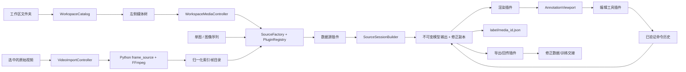

# 项目架构与维护入口

## 1. 文档目的

本文说明自动标注系统的模块边界、数据流和代码位置。Part 1.1 的核心原则是：模型输出契约只有一个权威 Schema，Python 与 Godot 分别提供可独立调用的验证器，原始模型输出保持不可变并使用 `model_output_vX` 版本前缀。

老师的 Assignment 是要求来源，本文件只解释当前真实实现，不扩展或改写老师的范围。

## 2. 总体数据流



`SourceFactory` 是所有 Source 创建入口。它让 `PluginRegistry` 按 `can_open`、priority 和可选 preferred ID 选择插件，创建独立实例并调用 `open`；打开失败时关闭候选实例。`image_sequence_source` 读取归一化帧源清单，并根据 `model_version` 定位同名模型输出文件。例如 `model_version: "model_output_v1"` 只允许读取 `model_output_v1.jsonl`。它不会退回读取无版本文件，也不会把记录中的 `source` 当成模型版本。

`SourceSessionBuilder` 随后把任何已打开插件规范化为一个经过深拷贝和验证的会话快照。旧的直接 Open 与工作区媒体选择都消费同一个快照，不再各自解释 Source 数据。`image_sequence_source`、`numeric_image_sequence_source` 和 `single_image_source` 因而共享创建、校验、播放和失败清理边界。

`source` 表示图像或帧来源，例如 `sample_v1`；`model_output_v1` 表示模型输出契约和文件版本。两者职责不同。

## 3. 前端组成与交互边界

应用外壳把真实标注视口放在两个可调整宽度的侧栏之间：

```text
MainVBox
├── TopToolbar
├── WorkspaceSplit
│   ├── DatasetExplorerContainer
│   │   └── DatasetExplorer
│   └── ContentSplit
│       ├── ViewportPanel
│       │   └── AnnotationViewport
│       └── RightSidebarContainer
│           └── RightSidebar
│               ├── InspectorScroll
│               │   └── InspectorPanel
│               ├── Separator
│               └── ToolPanel
├── TimelinePanel
└── StatusBar
```

`DatasetExplorer` 有工作区树和旧 Source 呈现两种只读模式，不是通用文件管理器。工作区模式只列出嵌套文件夹和逻辑媒体；视频和数字图片序列不在左树逐帧物化。选择媒体只发出一次请求，候选 Source、标注和编辑会话都验证后才事务替换当前界面。旧 Source 模式仍保留连续帧列表；超过 500 帧时只物化总数和当前帧，避免为 10,000 帧创建 10,000 个 `TreeItem`。

中央 `AnnotationViewport`、所选 Renderer 和图像坐标变换是唯一显示路径。右侧 `AnnotationSidebar` 显示项目类别与当前帧标注，其下方固定无分类、四列七工具区。Part 2.2 的工具 ID、名称、图标和可用性由 Edit plugin descriptors 提供。

各层所有权如下：

- `AnnotationMain` 组装应用并执行失败原子的 Source 替换；Source 创建交给 `SourceFactory`，Source 输出校验交给 `SourceSessionBuilder`，不直接加载具体 Source 插件脚本。
- `DatasetExplorer` 只拥有当前数据集的呈现和帧请求意图，不打开、验证、缓存、编辑或写入源数据。
- `WorkspaceCatalog` 递归发现图片、视频和数字图片序列，并为每个媒体建立最近数据集根的标签上下文索引；它不解码视频或读取图像像素。
- `WorkspaceMediaController` 只准备媒体 locator，并调用注入的同一个 `SourceFactory`；它不再拥有数字序列插件的私有构造路径。
- `SourceFactory` 只负责 Registry 路由、实例创建、`open` 结果类型和失败关闭；`SourceSessionBuilder` 只负责 manifest、record、entry、首帧纹理和 presentation 的公共校验与映射。
- `MediaLabelStore` 按该上下文拥有单个 `label/<media_id>.json`、原始帧 ID 索引和验证后原子替换；`WorkspaceSession` 只协调 300 ms 合并保存和切换前强刷新。
- `ToolPanel` 消费 Edit 插件的声明式工具描述，并把可用编辑意图与不可用工具意图分开。
- Source 插件拥有文件句柄和缓存，并返回 manifest 与模型记录的深拷贝。
- `AnnotationStore` 分别拥有不可变模型基线和可编辑修正副本。
- `AnnotationViewport` 负责输入到图像坐标的转换，并把绘制委托给注入的 Render 插件；未注入时只使用无业务依赖的 NullRenderer。
- Edit 插件拥有工具描述和临时手势状态；单帧修改或整段传播都作为一条命令进入 `CommandHistory`。
- Feedback 插件验证修正快照，在目标同级 staging 后原子发布带 manifest 和 SHA-256 的训练交接目录；它不覆盖 `model_output_v1.jsonl`。

这一界面组合不改变 Plugin API version 1，也不改变 Part 1 的 Source、Render、Edit、Feedback、Schema、Store、History、Renderer 或 Python 边界。

### 3.1 Part 1.4 插件结构

```text
client/pipeline/
├── plugin_api.gd                 # V1 方法/参数数量
├── plugin_descriptor.gd          # 发现元数据
├── plugin_registry.gd            # 多目录发现、Stage 继承校验、descriptor/script 工厂
├── source_factory.gd             # 统一 Source 路由、创建、打开与失败关闭
├── source_session_builder.gd     # 统一 Source 输出校验与帧身份映射
├── null_renderer.gd              # 视口的中性缺省对象
└── stages/
    ├── source_stage.gd
    ├── render_stage.gd
    ├── edit_stage.gd
    └── feedback_stage.gd

client/plugins/<stage>/<plugin>/
├── plugin.json                   # id/version/api/stage/entry/priority/capabilities
└── plugin.gd                     # 对应抽象 Stage 的实现
```

Registry 启动时从 Main 的 `plugin_roots` 发现 manifest，强制入口脚本继承声明的抽象 Stage，保存 descriptor 和 Script，不保存有状态插件单例。`SourceFactory` 使用 Registry 的 `resolve_source_plugin_id` 和 `create_plugin` 获得独立 Source 实例。Source 是否接受 locator 由 `can_open` 决定，默认按 priority 选择；格式无关的浏览元数据由 `get_presentation` 提供。Main 和 Workspace 不推测文件名，也不直接实例化插件。Edit 的按钮由 `get_tool_descriptors` 决定，Inspector 行为经 `invoke` 进入插件。因此增加新来源或替换工具不需要修改 Registry、Main、Workspace 或 ToolPanel 的格式分支。

范围传播把 keyframe 区域以 `overwrite` 或 `merge` 模式复制到闭区间目标帧。命令先构建并验证全部记录，然后由 Store 原子替换；目标记录的 `source`、`frame` 和 `time_s` 不变，整段只占一个 undo/redo 项。传播 marker 存入独立 batch operation 列表，Model Output V1 仍只包含其 Schema 允许的字段。

Feedback 输出如下，`manifest.json` 保存源数据集/模型/taxonomy 身份、覆盖信息、batch operations 与 artifact 的字节数和 SHA-256：

```text
training_update_v1/
├── manifest.json
└── data/
    └── corrected_annotations.jsonl
```

### 3.2 Part 2.1 Display 坐标与渲染边界

`ViewportTransform` 是唯一 camera。它先以 `min(viewport_width / image_width, viewport_height / image_height)` 计算保持宽高比的 fit scale，再合并 user zoom、letterbox 和 viewport-space pan 生成唯一 `Transform2D`。所有绘制都使用正矩阵，所有 picking 和 Edit pointer 都使用其 `affine_inverse()`。鼠标锚点缩放保持指针下的图像点；视口 resize 保持旧中心对应的图像点；`Fit` 恢复 fit-only 状态。

`AnnotationViewport` 还是 Store 数据进入显示链的深拷贝边界。它只在纹理、record、selection、opacity 或 transform 改变后 `queue_redraw()`。letterbox 或图像外按下只清除选择，不向 Edit 传递非法图像坐标；从图像内开始的拖动在越界后夹紧到图像边界。

`RegionGeometry` 定义 Render 与 Edit 共用的几何规则：有效 `polygon` 优先，`box` 只在 polygon 无效或缺失时回退。Model Output V1 的复杂 polygon 边界是单环、非自交、可凸可凹；不支持 holes 或 multipolygon，也不为此扩展 Schema。Renderer 对 record 变化解析并缓存 image-space primitive、class color、label 和 AABB；zoom/pan 只重建 screen-space command，并以变换后 AABB 跳过完全在视口外的 region。

`Overlay opacity` 只修改 class-color fill alpha。outline、label、confidence、label background 和 handle 保持清晰，选中 region 使用全不透明填充与加粗边框。缺失 `filled` 的合法 Model Output V1 region 默认显示 fill；编辑副本的 `filled: false` 仍可关闭未选中填充。

当前不使用 shader、texture atlas 或 RenderingServer mesh。`CanvasItem` dirty redraw、几何缓存、视口裁剪和单一拷贝边界已通过真实基准；实测方法、原始数据和设备限制见根目录 `RESULTS.md` 和 `tests/benchmarks/results/part2_1_display.json`。

### 3.3 Part 2.2 编辑几何、命令与键盘边界

> 状态（2026-09-05）：七工具运行时、真实视口、键盘和 undo/redo 自动化门禁已实现；可见编辑性能与人工 reviewer 尚未完成，因此 Part 2.2/2.3 仍保持待验证。

#### 3.3.1 参考与适配边界

交互以官方 [MITK Segmentation View](https://docs.mitk.org/latest/org_mitk_views_segmentation.html) 为 Assignment 指定主参考，同时参考 [3D Slicer Segment Editor](https://slicer.readthedocs.io/en/5.8/user_guide/modules/segmenteditor.html)、[CVAT Brush/Mask](https://docs.cvat.ai/docs/annotation/manual-annotation/shapes/annotation-with-brush-tool/) 和 [QuPath annotation tools](https://qupath.readthedocs.io/en/stable/docs/starting/annotating.html)。这些成熟工具能持久化 raster mask、holes 和多连通分量；本客户端只借鉴手势、预览、笔刷和拒绝反馈，不扩展 Model Output V1。

#### 3.3.2 组件边界

`AnnotationViewport` 新增独立 `EditOverlay`，它与正式 Renderer 共用唯一 image→viewport `Transform2D`，但不使用或修改 Store record。开放轮廓、笔刷圆、候选 mask 和告警几何全部由 overlay 绘制；删除向 record 塞入 `__contour_preview`/`__brush_preview` 假 region 的路径。

`basic_edit_tools` 只编排活动工具、手势状态和 command 提交。纯逻辑 `MaskRegionOps` 在当前图像的局部 ROI 中处理 Paint/Eraser、标注边界 Fill 与 mask 拓扑，`PolygonOps` 处理 Lasso/Subtract/简化/拓扑分类，`ImageRegionAlgorithms.polygonize_mask` 只作为 mask 外边界的纯几何转换依赖。带状态插件不在每个 pointer-motion 深拷贝整帧 record。新逻辑只使用 Godot `Image`/`Geometry2D`，不增加 Python 或 native 运行时依赖。

#### 3.3.3 统一状态机与提交

所有工具使用 `Idle → Drawing/Candidate → AwaitingClass|Commit|Reject` 状态机。开放轮廓和可提交候选保存在独立 `EditOverlay`，红色表示当前候选违反 V1。Paint/Eraser 的 Drawing 状态不画输入轨迹，而是显示操作后的真实 mask；修补时正式 Renderer 暂时抑制目标 region，新建时不抑制任何已有 region。拒绝状态保持可见，用户可继续修正或用 Escape 取消，不会因为中间输入少于三点而静默消失。

Paint/Eraser 在 pointer-motion 中只更新局部 raw mask；pointer-up/Enter 才执行外轮廓提取和 V1 检查。Paint 无重合且为单环时进入待分类状态；空心结果保留为橙色 `WorkingMask`。Fill 对该 mask 逐次做四邻域填充并写回 session；仍有孔洞时继续等待 Fill，只有得到单个实心 V1 polygon 时才进入待分类状态。Lasso/Subtract 优先使用精确简单多边形；自交或重复交点时，`MaskRegionOps.fill_all_enclosed()` 在局部 ROI 内提取所有不连通外边界的空白分量，与轨迹合并成实心 mask 后再转回 V1 polygon。无选区 Subtract 对每个 region 计算差集：单环替换、空结果删除、其他拓扑整批拒绝；全部通过后才用一条 `ReplaceFrameCommand` 提交。

zoom/Fit/pan 不清除 overlay。开始编辑会暂停播放；切帧、seek 或切换工具会先取消未提交预览，类别对话框打开时则阻止导航，从而避免候选被下一帧静默替换。

#### 3.3.4 工具清单与键盘语义

工具栏为 7 个可用工具：Add Box、Subtract、Lasso、Fill、Paint、Eraser 和 Select。Close Gaps 与点击即整区删除的旧 Erase descriptor 均已移除；Eraser 只承担减法笔刷修正。Select 统一选中、拖动移动、box/polygon 八柄缩放与 1/5/10 image-px keyboard nudge，不恢复独立 Move/Resize 工具。

Paint/Eraser 共用 1–40 image-px 圆形笔刷，默认半径 8 px；选中工具即显示跟随鼠标的细半径环，不画轨迹或中心点。Paint 重合唯一/选中 region 时做 union；无重合的单环创建新对象，闭合空心轮廓留给 Fill。Eraser 必须先选中 region。Subtract 有选区时做单对象减法，无选区时作为多对象大范围删减。右键只发出选择取消意图，Main 原子清除临时编辑、选区和 hover，再同步切回 Select，不创建 history。

Region Growing 未被 Assignment 要求，且对本医疗场景的单点颜色容差结果不够稳定，因此已删除。Live Wire 在确定为直线 anchor 连接后与 Lasso 的逐点轮廓语义重复，也已从用户可见和可调用合同中删除。

键盘直达为 `V/A/S/L/F/P/Shift+P`；`C` / `E` / `G` / `I` 不绑定工具。空闲 Select 中的 Delete/Backspace 删除整个选中 region，工具栏和 Inspector 都不提供整区删除按钮。Lasso/Subtract 鼠标松手时按 12 viewport px 的缩放无关阈值自动吸附首尾；距离过大时保留轨迹，`Space` 可强制闭合，Enter 不会重复提交。键盘空间模式用 arrows 以 1/5/10 image px 移动图像光标/轮廓；视口平移只由鼠标中键拖动触发。整个客户端不提供 Undo 按钮，撤销只由 `Ctrl+Z` 触发；Redo 保留 `Ctrl+Shift+Z`/`Ctrl+Y` 和现有按钮。Tab/Shift+Tab 继续提供标准 focus traversal。Inspector 同时提供可选 taxonomy class list 和非空自由文本输入，两者经同一 relabel command 路径修改 class；原 `Fill` 显示开关改名 `Show overlay fill`，不再冒充 Assignment Fill 编辑。

#### 3.3.5 验收边界

自动测试经过真实 `ToolPanel → AnnotationViewport → Edit plugin → CommandHistory → Store` 路径，而不是只调用插件私有方法。七个工具、zoom/pan 预览保留、整区删除键、V1 拒绝路径、单手势单 command 和 200 条 history 上限均有自动化覆盖。Add Box、Subtract、Lasso、Fill、Paint、Eraser，以及 Select 的 move、resize、nudge、整区删除和 Inspector 的 taxonomy list/free-text relabel，都验证 `Ctrl+Z` 撤销和 redo 恢复。

可见基准在 1280×800、约 20 regions 下分别连续 10 s 执行 Select 拖动、Paint、Eraser 和 zoom/pan；门槛为平均 `≥30 fps`、p95 帧间隔 `≤40 ms`，无轨迹闪烁/漂移/中途消失。README Reviewer Script 必须在正式样本和暂停的手术视频帧上真实复跑，并列出所有编辑动作（含 Inspector 重标注）的纯键盘可达路径、工具快捷键和人工检查结果；缺少任一路径即不能发布。根目录 `RESULTS.md` 必须逐项说明哪些 MITK 交互被直接采用、哪些为适配 V1 而模拟、哪些被舍弃及原因。只有 Python/Godot 全套、schema `0 errors`、原始 model digest 不变、全部 undo/redo 与键盘测试、基准和人工步骤通过后，Part 2.2/2.3 才能标记 PASS。不实施 Assignment 明确列为 optional 的持久化 polygon vertex editing，也不引入 holes、multipolygon、mask 导出或 Part 3.2 功能。

### 3.4 Part 3.1 视频导入与播放所有权

`VideoImportController` 是原始视频的导入任务边界，不是新的 codec-level Source 插件，也不修改 Source API version 1。它只使用项目固定的 `.venv/bin/python` 通过 `OS.create_process()` 启动 `python/frame_source.py`，轮询原子 JSON progress/result 文件，并用 cancel 文件请求协作式取消。Python 子进程负责终止自己的 FFmpeg、删除本任务 staging，只在 probe、extract、validate 和 publish 全部成功后原子发布新目录。原视频、已有目标和当前数据集不属于导入任务的可变状态。

`PlaybackController` 只拥有播放/暂停、帧间隔累积、播放时钟和下一个请求索引；`AnnotationMain` 仍是 current frame 和原子 frame commit 的唯一所有者。顶部 `PlaybackSpeedControl` 常驻部分只显示当前速度，点击后才弹出 Custom、3 s/frame、默认 1 s/frame 和 Max 调节条；前三者换算为 review FPS，Max 不增加人工等待。每个 `_process(delta)` 最多请求 `current + 1`；定时模式丢弃超出的累积时间，Max 也保持一次一个索引，因此加载或渲染较慢时只会降低实际播放率，不会跳帧追钟。运行条把已提交 Source entry 的 `time_s` 格式化为显式 `HH:MM:SS.mmm`，并单独显示实际交付 FPS；时间不是墙钟计时。`PlaybackFpsMeter` 只接收成功原子提交后的单调时钟采样。速度、时间和统计状态只用于展示，不改变 Store、dirty frames、原始 `frame_id`/`time_s` 或文件。Previous、Next、timeline 和 Explorer seek 都先暂停；切换速度也会暂停并清空旧累积时间；最后一帧停止且不循环；加载失败保留最后成功画面并暂停。

图像像素由当前 Source 插件按需加载：`image_sequence_source` 处理带 manifest 的归一化目录，`numeric_image_sequence_source` 处理数字文件名的原生图像序列，`single_image_source` 处理单图。序列插件内的 `FrameCache` 是上限 12 的 LRU；manifest、frame entries 和 annotation metadata 可以驻留内存。Timeline 只在 `_draw()` 中画可见 cell，不为每帧创建 Button。首版不在工作线程创建 `ImageTexture`，也不引入 codec player、预取或跳帧。

### 3.5 工作区标注与三种身份

`playback_index` 是时间轴中的连续位置，`frame_id` 是数据集的原始帧号，`sample_id` 是训练边界才派生的 `<media_id>_<frame_id:06d>`。例如 `VID68` 的第一个播放项可以是 `playback_index=0`、`frame_id=16`、`sample_id=VID68_000016`。`AnnotationMain.set_frame()` 先同时解析图像、时间和原始帧 ID 标注，全部有效后再提交 viewport 与 timeline，因此连续播放不会把帧 23 的标注画在帧 16 上。

`SourceSessionBuilder` 强制位置 `i` 的 entry 使用 `frame == i`，将可选 `frame_id` 规范为原始数据帧号（缺失时等于 `frame`），并要求位置 `i` 的 record 使用该 `frame_id`。播放器只消费连续 `playback_index`；Store、标注键、dirty frames 和 Feedback 始终消费原始 `frame_id`。

每个媒体的原生文件只有其最近数据集根下的 `label/<media_id>.json`。目录扫描生成的内存索引同时驱动原生读取、只读 `labels/` 导入和自动保存，因此打开外层大目录也不会把标注写到错误层级。`frames` 字典的键是不补零的原始帧 ID；键缺席表示尚未标注，显式 `regions: []` 才表示已确认负样本。如果已有原生文件，它优先于同一数据集根下的只读 `labels/` 标注；否则 CholecT50 适配器可做一次导入。详细格式和失败策略见 `docs/workspace-label-storage-design.md`。

数字图像序列没有一个能诚实代表整个媒体的原文件哈希，因此 manifest 显式使用 `source_sha256: null`。Feedback 导出保留该 null，并要求 corrected records 按原始 `frame_id` 严格递增、dirty frame 必须存在于 record 集合。这保证稀疏序列不被重新编号，同时不伪造 SHA-256。

## 4. Part 1.1 模块所有权

| 职责 | 权威文件 | 主要调用方 |
|---|---|---|
| Model Output V1 字段、类型和必填性 | `core/schemas/model_output_v1.schema.json` | Python 验证器、测试、模型输出生产方 |
| Python 独立验证入口 | `python/validate_model_output.py` | 命令行、Python 调用方、样本验收 |
| Python Schema 加载与严格类型检查 | `python/annotation_data/contracts.py` | 独立验证器、样本生成器 |
| Godot 等价验证 | `client/domain/model_output_validator.gd` | 数据源、Store、导出插件 |
| 不可变模型基线与修正副本 | `client/domain/annotation_store.gd` | 编辑命令、界面、导出插件 |
| Source 路由与会话校验 | `client/pipeline/source_factory.gd`、`source_session_builder.gd` | Main、Workspace media controller |
| 版本化目录读取 | `client/plugins/source/image_sequence_source/plugin.gd` | 主应用 |
| 数字图像序列适配 | `client/plugins/source/numeric_image_sequence_source/plugin.gd` | SourceFactory |
| 单图空记录适配 | `client/plugins/source/single_image_source/plugin.gd` | 主应用 |
| 修正副本导出 | `client/plugins/feedback/file_training_handoff/plugin.gd` | 后续导出界面 |
| 跨语言合法/非法样例 | `tests/fixtures/model_output_v1/{valid,invalid}/` | Python 与 Godot 测试 |
| Part 1.1 Python 测试 | `tests/python/test_part1_1_data_contract.py` | 自动化门禁 |
| Part 1.1 Godot 测试 | `tests/godot/test_model_output_validator.gd` | 自动化门禁 |

`core/schemas/` 只存放 Part 1.1 的模型输出 Schema。帧源清单位于 `core/frame_source/`，属于 Part 1.3 的内部契约，不能把它解释成第二个 Part 1.1 Schema。

## 5. 契约边界

### 5.1 权威 Schema

`core/schemas/model_output_v1.schema.json` 使用 JSON Schema Draft 2020-12。顶层必填字段只有：

- `schema_version`：固定为整数 `1`；
- `source`：非空帧源标识；
- `frame`：从 `0` 开始的非负整数索引；
- `regions`：区域数组。

`time_s` 可选且必须为非负有限数。每个区域必填 `id`、`class`、`kind`，并至少包含 `box` 或 `polygon` 之一；二者可以同时出现。`conf` 可选且范围是 0–1，`track_id` 可选并允许字符串或 `null`。

Python 与 Godot 都按 JSON Schema 的数学整数语义解释 `integer`：`1` 和 `1.0` 是同一个整数值；布尔值、非有限数和带非零小数部分的数不是整数。两端共同读取 `tests/fixtures/model_output_v1` 中的整数边界样例，防止再次出现数值语义分叉。

Schema 使用 `additionalProperties: false`，因此 `dataset_id`、`image_size`、`filled` 等项目内部字段不能混入模型输出记录。

### 5.2 两端验证

Python 入口 `python/validate_model_output.py` 可以作为脚本运行，也能导入以下函数：

- `load_schema()`：读取唯一的 V1 Schema；
- `validate_record(record)`：校验单条记录；
- `validate_model_output(path)`：校验单条 JSON 或逐行 JSONL；
- `main(argv)`：提供命令行退出码。

Godot 使用 `ModelOutputValidator.validate_record(record)` 实现同等字段规则。两端共用 `tests/fixtures/model_output_v1` 中的代表性样例，避免规则漂移。预期错误以数组返回并带字段路径，例如 `regions.0.class`；不会通过未捕获异常使界面崩溃。

### 5.3 不可变模型输出

`AnnotationStore.load_model_records()` 先验证全部候选记录，只有全部通过才一次性替换状态。加载时执行深拷贝，并分别保存：

- `_model_records`：不可变的模型基线；
- `_corrected_records`：供人工编辑的独立副本。

所有 getter 和快照接口都返回深拷贝。`replace_corrected_record()` 只更新修正副本；`model_digest()` 对按帧排序、键名规范化后的模型基线计算 SHA-256。测试证明外部修改返回值或编辑修正副本都不会改变该摘要。

`filled` 只用于界面显示。它可以存在于编辑中的修正记录，但 `_model_output_projection()` 会在契约验证和规范快照边界删除它，避免污染模型输出契约。

### 5.4 版本化文件读取

图像序列数据源的规则如下：

1. `model_version == "model_output_v1"` 时，只读取 `model_output_v1.jsonl`；
2. `model_version == "none"` 时，可以按帧清单合成空 `regions` 记录；
3. 其他 `model_output_vX` 版本会以可读错误拒绝，等待对应验证器实现；
4. 无版本文件不会作为兼容回退；
5. 每条记录的 `source` 必须与清单的 `source_name` 一致；
6. 读取、验证或图像解码失败时，保留此前已打开的有效数据源。

这是一条故障隔离边界：候选数据只有在完整验证后才替换当前状态，格式错误只形成可读错误，不传播为界面崩溃。

## 6. 其他项目模块

| 模块 | 主要位置 | 职责 |
|---|---|---|
| 应用组装 | `client/app/main.gd`、`client/app/main.tscn` | 连接界面、Store 和插件，不实现契约规则 |
| 插件注册 | `client/pipeline/plugin_api.gd`、`plugin_registry.gd` | 定义并发现数据源、渲染、编辑、回传阶段 |
| Source 工厂 | `client/pipeline/source_factory.gd` | 通过 Registry 统一路由、创建、打开和失败关闭 |
| Source 会话快照 | `client/pipeline/source_session_builder.gd` | 校验并分离 `playback_index` 与 `frame_id` |
| 视口与坐标 | `client/services/viewport_transform.gd`、`client/ui/annotation_viewport.gd` | 唯一 `Transform2D` 正逆变换、缩放、平移、Fit 和输入边界 |
| Region 几何与显示 | `client/domain/region_geometry.gd`、`canvas_region_renderer/plugin.gd` | polygon-first 几何、hit-test、overlay 缓存、opacity 和裁剪 |
| 编辑工具 | `client/plugins/edit/basic_edit_tools/plugin.gd` | 7 个工具、指针/键盘手势、实时 mask 与 viewport-only preview；自动化通过，人工门禁待完成 |
| Polygon 几何 | `client/domain/polygon_ops.gd` | single-ring 验证、boolean、brush、close、V1 拓扑分类 |
| Mask 边界转换 | `client/domain/image_region_algorithms.gd` | 为 `MaskRegionOps` 提供 `polygonize_mask`；不暴露编辑工具 |
| 编辑命令 | `client/domain/commands/`、`command_history.gd` | 已验证的可撤销修改，最多 200 条 |
| 样本生成 | `python/annotation_data/sample.py`、`python/make_sample_input.py` | 生成 `sample_v1` 和 `model_output_v1.jsonl` |
| 帧源归一化 | `python/annotation_data/frame_source.py`、`python/frame_source.py` | 将视频解码为索引帧和内部数据清单 |
| 视频导入任务 | `client/services/video_import_controller.gd` | 非阻塞启动固定 Python、轮询进度、取消和成功后交给现有 Source |
| 逐帧播放 | `client/services/playback_controller.gd`、`client/services/playback_fps_meter.gd`、`client/ui/playback_speed_control.gd`、`client/app/main.gd` | Custom/3 s/1 s/Max 时钟、实际 FPS、不跳帧状态机与原子帧提交 |

帧源归一化先用 `ffprobe` 获取第一个视频流的帧时间，再用同一个 `0:v:0` 流逐帧输出 PNG。FFmpeg 默认应用显示旋转，manifest 因此从实际 PNG 读回显示后宽高，并拒绝中途变尺寸的序列。负起始 PTS 整体平移到零而不改变帧间隔；整段无 PTS 时用 nominal FPS 合成时间，部分缺失则拒绝。发布前还会核对探测帧数与 PNG 帧数，然后原子替换到目标目录。可选 CLI control files 使用原子 progress JSON、cancel request 和显式 sibling staging，同时保持原两参数调用与 `--result-file` 格式兼容。客户端只读发布后的索引帧目录契约，因此视频与原生图像序列走同一 Source 路径。

## 7. 常见修改导航

| 我要修改什么 | 首要文件 | 必须同步检查 | 重点测试 |
|---|---|---|---|
| 模型输出字段、类型、必填性 | `core/schemas/model_output_v1.schema.json` | Python/Godot 验证器、共享样例、样本生成器 | `test_part1_1_data_contract.py`、`test_model_output_validator.gd` |
| Python 错误格式或 CLI 行为 | `python/validate_model_output.py` | `python/annotation_data/contracts.py` | Part 1.1 Python 测试 |
| 客户端即时拒绝条件 | `client/domain/model_output_validator.gd` | Schema 与共享样例 | Godot 验证器测试 |
| 模型不可变或修正副本行为 | `client/domain/annotation_store.gd` | 编辑命令、导出插件 | `test_annotation_store.gd` |
| 模型文件版本选择 | `client/plugins/source/image_sequence_source/plugin.gd` | 样本清单中的 `model_version` | `test_source_plugin.gd` |
| Source 路由或公共输出契约 | `source_factory.gd`、`source_session_builder.gd` | 三个 Source 插件、Main、Workspace | `test_source_factory.gd`、`test_source_session_builder.gd` |
| 帧来源名称 | 模型生产方的 `source` 与清单 `source_name` | Source 对齐检查 | Python 样本测试、Godot Source 测试 |
| 类别或颜色显示 | `client/domain/taxonomy.gd` | 渲染器、属性面板 | 渲染与界面测试 |
| Part 2.1 坐标或几何 | `viewport_transform.gd`、`region_geometry.gd` | Viewport、Renderer、Edit 和样本 | `test_viewport_transform.gd`、`test_region_geometry.gd`、`test_renderer.gd` |
| Part 2.1 性能 | `canvas_region_renderer/plugin.gd`、`tests/benchmarks/godot/display_benchmark.gd` | `RESULTS.md`、原始 benchmark JSON | 可见窗口 1280×800 基准 |
| Part 2.2 基础编辑/键盘 | `basic_edit_tools/plugin.gd`、`client/domain/commands/` | Inspector、Store、History、Renderer handles | `test_edit_integration.gd`、`test_keyboard_reachability.gd` |
| Part 2.2 boolean/图像工具 | `polygon_ops.gd`、`image_region_algorithms.gd` | V1 refusal、preview、导出投影 | `test_polygon_ops.gd`、`test_image_region_algorithms.gd`、`test_advanced_edit_tools.gd` |
| Part 2.3 交互忠实度 | `RESULTS.md` | README reviewer script、Assignment 2.2 | `test_documentation.py` |
| Part 3.1 播放或时间契约 | `playback_controller.gd`、`main.gd` | Source frame entries、Timeline、Explorer | `test_playback_controller.gd`、`test_playback.gd`、可见播放基准 |
| Part 3.1 导入或取消 | `video_import_controller.gd`、`python/frame_source.py` | `.venv`、FFmpeg/FFprobe、归一化目录 | Python 视频测试、Godot 子进程测试、真实导入基准 |
| 人工审核业务条件 | 后续独立审核状态模块 | 不得加入 Part 1.1 Schema | 后续 Part 3 测试 |

修改 V1 规则时，先对照 Assignment，再决定是否仍是兼容的 V1。不要先套用额外设计规范，也不要凭计划文档增加老师未要求的字段。

## 8. 验证命令

从仓库根目录运行：

```bash
.venv/bin/python python/make_sample_input.py --output sample/assignment_v1 --seed 6006
.venv/bin/python python/validate_model_output.py sample/assignment_v1/model_output_v1.jsonl
tests/run_tests.sh
"$GODOT_BIN" --path . --script tests/benchmarks/godot/display_benchmark.gd -- \
  --output /tmp/part2_1_display.json --warmup 2 --duration 10
.venv/bin/python tests/benchmarks/make_part3_sources.py \
  --playback-output /tmp/annotool-part3-playback \
  --stress-output /tmp/annotool-part3-stress
"$GODOT_BIN" --path . --script tests/benchmarks/godot/playback_benchmark.gd -- \
  --source /tmp/annotool-part3-playback --output /tmp/part3_1_playback.json --duration 10
"$GODOT_BIN" --headless --path . --script tests/benchmarks/godot/long_source_benchmark.gd -- \
  --source /tmp/annotool-part3-stress --output /tmp/part3_1_long_source.json
```

成功标准是独立验证器输出 `Validation errors: 0`、Python 测试无失败、Godot 完整套件最终输出 `PASS: complete Godot test suite`，且四个 Part 2.2 focused scripts 各自状态 0。Part 2.1 额外要求可见窗口基准平均 `≥30 fps`、p95 帧间隔 `≤40 ms`、图像坐标误差 `≤1e-5`。Part 2.2 还要求拒绝不修改 Store/history、每次成功手势只一条 command，并完整保留 Model Output V1 投影。Part 3.1 额外要求实际交付的帧索引连续、零跳帧，10,000 帧源的纹理缓存 `≤12`，Explorer/Timeline 不逐帧创建 UI 节点。性能数字只能对实测设备声明。验证前后原始模型输出文件的 SHA-256 必须一致。
