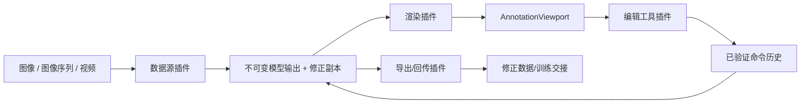

# 项目架构与维护入口

## 1. 文档目的

本文说明自动标注系统的模块边界、数据流和代码位置。Part 1.1 的核心原则是：模型输出契约只有一个权威 Schema，Python 与 Godot 分别提供可独立调用的验证器，原始模型输出保持不可变并使用 `model_output_vX` 版本前缀。

老师的 Assignment 是要求来源，本文件只解释当前真实实现，不扩展或改写老师的范围。

## 2. 总体数据流



数据源插件先读取帧源清单，再根据清单中的 `model_version` 定位同名模型输出文件。例如 `model_version: "model_output_v1"` 只允许读取 `model_output_v1.jsonl`。它不会退回读取无版本文件，也不会把记录中的 `source` 当成模型版本。

`source` 表示图像或帧来源，例如 `sample_v1`；`model_output_v1` 表示模型输出契约和文件版本。两者职责不同。

## 3. 前端组成与交互边界

应用外壳把真实标注视口放在两个可调整宽度的侧栏之间：

```text
MainVBox
├── TopToolbar
├── WorkspaceSplit
│   ├── DatasetExplorerContainer
│   │   └── DatasetExplorer
│   └── ContentSplit
│       ├── ViewportPanel
│       │   └── AnnotationViewport
│       └── RightSidebarContainer
│           └── RightSidebar
│               ├── InspectorScroll
│               │   └── InspectorPanel
│               ├── Separator
│               └── ToolPanel
├── TimelinePanel
└── StatusBar
```

`DatasetExplorer` 只是 `AnnotationMain` 已接受数据源的只读投影，不是通用文件管理器。只有候选数据源事务完整提交后，它才接收由标签和路径组成的深拷贝视图模型。用户选择帧只发出一次导航请求；程序更新当前帧高亮时会抑制反向事件，避免反馈循环。单图模式只显示真实图像及一个索引帧；规范化目录显示 manifest 中的帧，并只列出确实存在的元数据文件。

中央 `AnnotationViewport`、既有 Renderer 和图像坐标变换仍是唯一显示路径。右侧 `InspectorPanel` 位于可滚动区域中，其下方固定无分类、四列的十二槽工具区。Add Box、Fill、Erase、Selection、Move / Resize 进入现有 Edit 插件；Subtract、Lasso、Close、Paint、Wipe、Region Growing、Live Wire 只进入界面层不可用信号，精确显示 `待开发`，不会修改当前工具、选择、标注、手势或历史。

各层所有权如下：

- `AnnotationMain` 组装应用并执行失败原子的 Source 替换，不实现解码、绘制、编辑或导出细节。
- `DatasetExplorer` 只拥有当前数据集的呈现和帧请求意图，不打开、验证、缓存、编辑或写入源数据。
- `ToolPanel` 拥有声明式十二槽呈现表，并把可用编辑意图与不可用工具意图分开。
- Source 插件拥有文件句柄和缓存，并返回 manifest 与模型记录的深拷贝。
- `AnnotationStore` 分别拥有不可变模型基线和可编辑修正副本。
- `AnnotationViewport` 负责输入到图像坐标的转换，并把绘制委托给 Render 插件。
- Edit 插件只拥有临时手势状态；完成的修改作为一条命令进入 `CommandHistory`。
- Feedback 插件验证修正快照并通过同目录临时文件加重命名原子发布独立 JSONL；它不覆盖 `model_output_v1.jsonl`。

这一界面组合不改变 Plugin API version 1，也不改变 Part 1 的 Source、Render、Edit、Feedback、Schema、Store、History、Renderer 或 Python 边界。

## 4. Part 1.1 模块所有权

| 职责 | 权威文件 | 主要调用方 |
|---|---|---|
| Model Output V1 字段、类型和必填性 | `core/schemas/model_output_v1.schema.json` | Python 验证器、测试、模型输出生产方 |
| Python 独立验证入口 | `python/validate_model_output.py` | 命令行、Python 调用方、样本验收 |
| Python Schema 加载与严格类型检查 | `python/annotool/contracts.py` | 独立验证器、样本生成器 |
| Godot 等价验证 | `client/domain/model_output_validator.gd` | 数据源、Store、导出插件 |
| 不可变模型基线与修正副本 | `client/domain/annotation_store.gd` | 编辑命令、界面、导出插件 |
| 版本化目录读取 | `client/plugins/source/image_sequence_source/plugin.gd` | 主应用 |
| 单图空记录适配 | `client/plugins/source/single_image_source/plugin.gd` | 主应用 |
| 修正副本导出 | `client/plugins/feedback/file_training_handoff/plugin.gd` | 后续导出界面 |
| 跨语言合法/非法样例 | `core/fixtures/valid/`、`core/fixtures/invalid/` | Python 与 Godot 测试 |
| Part 1.1 Python 测试 | `tests/python/test_part1_1_data_contract.py` | 自动化门禁 |
| Part 1.1 Godot 测试 | `tests/godot/test_model_output_validator.gd` | 自动化门禁 |

`core/schemas/` 只存放 Part 1.1 的模型输出 Schema。帧源清单位于 `core/frame_source/`，属于 Part 1.3 的内部契约，不能把它解释成第二个 Part 1.1 Schema。

## 5. 契约边界

### 5.1 权威 Schema

`core/schemas/model_output_v1.schema.json` 使用 JSON Schema Draft 2020-12。顶层必填字段只有：

- `schema_version`：固定为整数 `1`；
- `source`：非空帧源标识；
- `frame`：从 `0` 开始的非负整数索引；
- `regions`：区域数组。

`time_s` 可选且必须为非负有限数。每个区域必填 `id`、`class`、`kind`，并至少包含 `box` 或 `polygon` 之一；二者可以同时出现。`conf` 可选且范围是 0–1，`track_id` 可选并允许字符串或 `null`。

Schema 使用 `additionalProperties: false`，因此 `dataset_id`、`image_size`、`filled` 等项目内部字段不能混入模型输出记录。

### 5.2 两端验证

Python 入口 `python/validate_model_output.py` 可以作为脚本运行，也能导入以下函数：

- `load_schema()`：读取唯一的 V1 Schema；
- `validate_record(record)`：校验单条记录；
- `validate_model_output(path)`：校验单条 JSON 或逐行 JSONL；
- `main(argv)`：提供命令行退出码。

Godot 使用 `ModelOutputValidator.validate_record(record)` 实现同等字段规则。两端共用 `core/fixtures` 中的代表性样例，避免规则漂移。预期错误以数组返回并带字段路径，例如 `regions.0.class`；不会通过未捕获异常使界面崩溃。

### 5.3 不可变模型输出

`AnnotationStore.load_model_records()` 先验证全部候选记录，只有全部通过才一次性替换状态。加载时执行深拷贝，并分别保存：

- `_model_records`：不可变的模型基线；
- `_corrected_records`：供人工编辑的独立副本。

所有 getter 和快照接口都返回深拷贝。`replace_corrected_record()` 只更新修正副本；`model_digest()` 对按帧排序、键名规范化后的模型基线计算 SHA-256。测试证明外部修改返回值或编辑修正副本都不会改变该摘要。

`filled` 只用于界面显示。它可以存在于编辑中的修正记录，但 `_model_output_projection()` 会在契约验证和规范快照边界删除它，避免污染模型输出契约。

### 5.4 版本化文件读取

图像序列数据源的规则如下：

1. `model_version == "model_output_v1"` 时，只读取 `model_output_v1.jsonl`；
2. `model_version == "none"` 时，可以按帧清单合成空 `regions` 记录；
3. 其他 `model_output_vX` 版本会以可读错误拒绝，等待对应验证器实现；
4. 无版本文件不会作为兼容回退；
5. 每条记录的 `source` 必须与清单的 `source_name` 一致；
6. 读取、验证或图像解码失败时，保留此前已打开的有效数据源。

这是一条故障隔离边界：候选数据只有在完整验证后才替换当前状态，格式错误只形成可读错误，不传播为界面崩溃。

## 6. 其他项目模块

| 模块 | 主要位置 | 职责 |
|---|---|---|
| 应用组装 | `client/app/main.gd`、`client/app/main.tscn` | 连接界面、Store 和插件，不实现契约规则 |
| 插件注册 | `client/pipeline/plugin_api.gd`、`plugin_registry.gd` | 定义并发现数据源、渲染、编辑、回传阶段 |
| 视口与坐标 | `client/services/viewport_transform.gd`、`client/ui/annotation_viewport.gd` | 图像/视口坐标转换、缩放和平移 |
| 编辑命令 | `client/domain/commands/`、`command_history.gd` | 已验证的可撤销修改 |
| 样本生成 | `python/annotool/sample.py`、`python/make_sample_input.py` | 生成 `sample_v1` 和 `model_output_v1.jsonl` |
| 帧源归一化 | `python/annotool/frame_source.py`、`python/frame_source.py` | 将视频解码为索引帧和内部数据清单 |

## 7. 常见修改导航

| 我要修改什么 | 首要文件 | 必须同步检查 | 重点测试 |
|---|---|---|---|
| 模型输出字段、类型、必填性 | `core/schemas/model_output_v1.schema.json` | Python/Godot 验证器、共享样例、样本生成器 | `test_part1_1_data_contract.py`、`test_model_output_validator.gd` |
| Python 错误格式或 CLI 行为 | `python/validate_model_output.py` | `python/annotool/contracts.py` | Part 1.1 Python 测试 |
| 客户端即时拒绝条件 | `client/domain/model_output_validator.gd` | Schema 与共享样例 | Godot 验证器测试 |
| 模型不可变或修正副本行为 | `client/domain/annotation_store.gd` | 编辑命令、导出插件 | `test_annotation_store.gd` |
| 模型文件版本选择 | `client/plugins/source/image_sequence_source/plugin.gd` | 样本清单中的 `model_version` | `test_source_plugin.gd` |
| 帧来源名称 | 模型生产方的 `source` 与清单 `source_name` | Source 对齐检查 | Python 样本测试、Godot Source 测试 |
| 类别或颜色显示 | `client/domain/taxonomy.gd` | 渲染器、属性面板 | 渲染与界面测试 |
| 人工审核业务条件 | 后续独立审核状态模块 | 不得加入 Part 1.1 Schema | 后续 Part 3 测试 |

修改 V1 规则时，先对照 Assignment，再决定是否仍是兼容的 V1。不要先套用额外设计规范，也不要凭计划文档增加老师未要求的字段。

## 8. 验证命令

从仓库根目录运行：

```bash
.venv/bin/python python/make_sample_input.py --output sample/assignment_v1 --seed 6006
.venv/bin/python python/validate_model_output.py sample/assignment_v1/model_output_v1.jsonl
.venv/bin/python -m pytest tests/python -q
"$GODOT_BIN" --headless --path . --script tests/godot/test_runner.gd
```

成功标准是独立验证器输出 `Validation errors: 0`、Python 测试无失败、Godot 最终输出 `PASS: complete Godot test suite`。验证前后模型输出文件的 SHA-256 必须一致。
