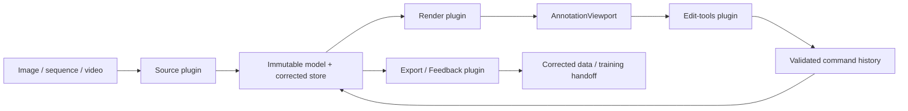

# Part 1 Architecture

The architecture follows the assignment's plugin pipeline while keeping the authoritative annotation state outside every replaceable plugin.

Video first passes through the Python frame-source adapter, which creates indexed PNG frames and a manifest with explicit frame indices and timestamps. A normalized directory and a standalone image then enter the same Source contract. The single-image adapter constructs an in-memory one-frame manifest; it never writes metadata beside the user's image.

## Ownership

- `AnnotationMain` composes the application and performs failure-atomic source replacement. It does not implement decoding, rendering, editing, or export behavior.
- A Source plugin owns its open file handles/cache and returns a deep copy of manifest entries and model records. The model snapshot is immutable after ingestion.
- `AnnotationStore` owns the immutable model baseline and the corrected copy. Consumers receive copied records, and accepted changes replace a whole validated frame record.
- `AnnotationViewport` owns input-to-image coordinate conversion and delegates drawing to the Render plugin. Render state is transient and never becomes annotation truth.
- The Edit plugin owns gesture state only. A completed mutation becomes one command in `CommandHistory`; cancellation discards previews without touching the store.
- The Feedback plugin receives a corrected snapshot, makes its own deep copy, changes only the copy to `human_corrected`, validates it, and publishes JSONL by sibling temporary file plus rename.

## Failure isolation

Plugin discovery validates manifests, API version, safe relative entry paths, constructability, and required methods. A broken plugin contributes a readable discovery error but cannot partially register. Source replacement stages and validates the full candidate—including frame zero texture and Edit activation—before closing the active source. Failed edits never enter history. Failed Feedback validation or publication preserves an existing export.

These boundaries make later stages replaceable: a frame server can replace the directory Source, another renderer can replace canvas drawing, and the Part 4 training package can extend the Feedback implementation without changing the core registry or the accepted API version 1 entry point.
