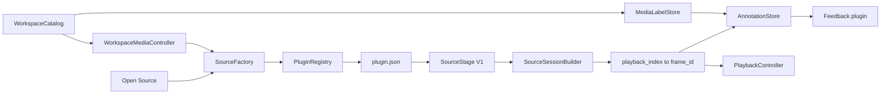

# Source 管线收敛设计

## 1. 背景与目标

当前的标准单图和归一化帧目录由 `client/plugins/source/`
中的 Source 插件打开，但工作区数字图片序列仍位于
`client/workspace/`，`WorkspaceMediaController` 也直接构造三种 Source。
这使真实的多媒体工作区路径绕过 Plugin Registry，与文档中“新增来源
无需修改核心”的承诺不一致。另外，Feedback 导出器把记录的
`frame` 错当成数组下标，因此无法导出 `16, 23, ...` 这类保留原始帧号的
工作区标注。

本阶段只收敛数据源和导出边界，目标是：

- 所有 Source 实例都由 Registry 管理的统一工厂创建和打开；
- 数字图片序列成为正式可发现插件，不再是工作区隐式实现；
- 旧的 `Open Source` 和工作区选择共用一个 Source 快照验证边界；
- 全程保留 `playback_index` 与原始 `frame_id` 的区别；
- Feedback 可原子导出稀疏帧号，且不伪造图片序列的内容哈希；
- 保持 Plugin API version 1，不扩张成大量微小插件。

## 2. 方案选择

### 方案 A：保留工作区内的直接构造

改动最少，但每增加一种来源都需修改
`WorkspaceMediaController`，Registry 也无法替换真实工作区中的 Source。
该方案不解决根本问题。

### 方案 B：为工作区参数升级 Source API

可以把 `media_id`、FPS 等上下文加入 `open()`，但会破坏现有 V1
插件及外部扩展的兼容性。这些字段实际属于工作区标注上下文，
不应反向污染通用 Source 契约。

### 方案 C：统一工厂 + V1 Source + 共享快照边界（采用）

`SourceFactory` 只负责通过 Registry 路由、创建、打开并在失败时关闭
Source。`SourceSessionBuilder` 只读取并验证 V1 输出，生成帧映射、
playback 条目和首帧纹理组成的候选快照。工作区层在快照之后再注入
`media_id`、标签根目录和持久化策略。

文件/目录 Open 与 `WorkspaceCatalog` 都先使用工厂的只读解析进行
locator 探测；工作区把命中的 Source ID 带到选择阶段，未命中视频
才进入 FFmpeg 归一化。快照一旦提交，Main 就固定已验证的 entry
映射；后续 Source 重新报告的映射与快照不等时，本次导航失败原子地被拒绝。

该方案保持 V1 稳定，又使两个入口共用同一个严格的候选验证边界，
是本次改造的最小可靠闭环。

## 3. 目标结构

新增或调整后的责任如下：

| 组件 | 唯一责任 |
|---|---|
| `PluginRegistry` | 发现、校验描述、按优先级路由并构造独立插件实例 |
| `SourceFactory` | 组合 Registry 的 resolve/create 与 Source `open/close` 失败处理 |
| Source 插件 | 识别一种 locator，返回索引帧、manifest、模型记录和按需纹理 |
| `SourceSessionBuilder` | 把不可信的 Source 输出验证为失败原子的候选快照 |
| `WorkspaceMediaController` | 选择媒体、管理视频导入任务与缓存身份；不知道插件脚本路径 |
| `AnnotationMain` | 组装候选会话，全部成功后一次性替换当前 UI 状态 |

## 4. Source 和帧身份契约

Source API version 1 不变。本次明确它的帧映射语义：

- `get_frame_entry(i).frame == i`：`frame` 是连续的 `playback_index`；
- `get_frame_entry(i).frame_id`：可选的原始数据集帧号，缺省时等于 `frame`；
- 第 `i` 条模型记录的 `frame` 必须等于该条目的 `frame_id`；
- `frame_id` 必须唯一、非负，工作区原生标注进一步限定为
  `0..999999`；
- Playback 始终使用连续下标，Store、dirty frame、标注 JSON 和训练导出
  始终使用原始 `frame_id`。

例如，序列只包含 `000016.png` 和 `000023.png` 时，共享快照为：

| playback_index | frame_id | 记录 `frame` |
|---:|---:|---:|
| 0 | 16 | 16 |
| 1 | 23 | 23 |

系统不会为了通过导出而把它们重编号为 `0, 1`。

## 5. Source 插件集合

`client/plugins/source/` 将只包含三个正式 Source：

- `image_sequence_source`：只接受包含 `manifest.json` 的归一化帧目录；
- `numeric_image_sequence_source`：接受至少两张以纯数字命名的 PNG/JPEG，
  数字值即原始 `frame_id`；
- `single_image_source`：接受单个 PNG/JPEG。

`can_open()` 只声明自己能真正打开的 locator，不再由多个 Source 对“任意目录”
同时返回 `true`。数字序列插件由原
`client/workspace/workspace_sequence_source.gd` 迁移而来，并去除非 V1 的
`open_for_media()` 入口。

## 6. Feedback 导出与源身份

Feedback 验证器不再要求 `record.frame == 数组下标`，而是要求：

- 记录帧号严格递增且唯一；
- `dirty_frames` 严格递增，每一项都是实际记录的帧号；
- `source_manifest.frame_count` 仍等于记录数，它是覆盖数而不是最大帧号加一。

单图和原始视频可提供真实文件 SHA-256。本地数字图片序列没有一个单独
的原文件，本阶段保留 `source_sha256: null`；Feedback 仅接受合法 SHA-256
或 `null`，并在导出 manifest 中如实保留。包身份仍由数据集 ID、可选源哈希、
不可变模型摘要和修正产物 SHA-256 的规范 JSON 计算。这比对文件名或修改时间
计算伪“内容哈希”更诚实，也避免打开大序列时预先读取所有图片。

## 7. 失败原子性和性能边界

- 路由失败、插件实例化失败、`open()` 返回类型错误或快照校验失败时，
  候选 Source 都会关闭，当前画面、Store 和工作区标注不变；
- 首帧纹理是候选会话唯一的强制像素读取，后续继续使用 12 帧有界 LRU；
- 路由只读目录项和 manifest 存在性，不为 `can_open()` 解码图片；
- 本次不改变播放时钟、帧缓存或渲染算法。

## 8. 迁移与验收

迁移按以下可回归单元执行：

1. 先添加失败测试，覆盖三个 Source 发现、目录路由、工厂错误隔离和
   Workspace Controller 注入；
2. 迁移数字序列插件，收紧两种目录 Source 的 `can_open()`；
3. 添加共享 SourceFactory，移除 Workspace Controller 中的 Source 脚本预加载；
4. 添加共享 SourceSessionBuilder，让旧入口与工作区入口共用帧映射校验；
5. 添加稀疏帧号 + `source_sha256: null` 导出测试后修正 Feedback；
6. 更新 README、Architecture、Plugin API 和 requirements traceability；
7. 通过定向 Godot 测试、219 项 Python 测试、完整 Godot 套件和样例
   `0 errors` 门禁。

## 9. 明确非目标

本阶段不拆分已经统一管理的七个 2D 工具，不把 Catalog、Cache、Playback、
CholecT50 Adapter 或 NullRenderer 伪装成插件，不实现 Assignment Part 3.2
传播算法，也不在本次改造中扩展 Model Output V1 Schema。
